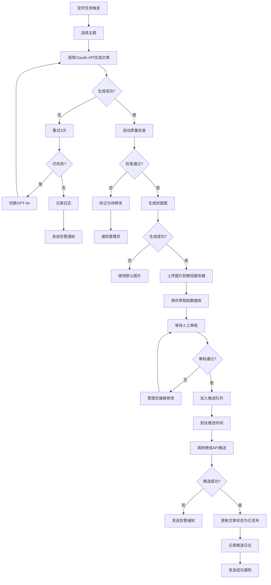

# 自动化文章生成并推送到微信公众号系统 PRD

## 文档信息
- **项目名称**: 自动化文章生成并推送到微信公众号系统
- **文档版本**: v1.0
- **创建日期**: 2026-01-19
- **产品经理**: Claude AI
- **目标用户**: 技术内容创作者、企业技术团队、开源项目维护者
- **开发周期**: 4周（MVP）

---

## 1. 需求概述

### 1.1 项目背景

**现状痛点:**
- 技术内容创作耗时耗力,难以保持日更频率
- 个人博主和企业团队缺乏专职内容运营人员
- 技术知识沉淀难以及时分享给目标受众
- 公众号活跃度低,影响品牌影响力

**业务机会:**
- AI技术成熟,可生成高质量技术内容
- 微信公众号是重要的技术内容分发渠道
- 自动化运营可节省80%内容创作时间
- 日更频率能显著提升账号活跃度和粉丝增长

**项目目标:**
建立一套完整的AI驱动文章生成、审核、推送系统,实现技术内容自动化运营。

### 1.2 产品价值

**用户价值公式:**
```
产品价值 = (新体验 - 旧体验) - 替换成本

新体验:
- AI自动生成高质量技术文章
- 每天自动推送,保持账号活跃
- 节省80%内容创作时间
- 建立技术品牌影响力

旧体验:
- 手动撰写文章,每天耗时2-4小时
- 难以保持日更频率
- 内容质量不稳定
- 缺乏系统化内容规划

替换成本:
- 系统开发部署成本(一次性)
- AI API调用成本(每月约$20-50)
- 人工审核时间(每篇文章5-10分钟)
```

**结论:** 对于技术内容创作者,这个系统的价值远大于替换成本。

### 1.3 目标用户

**主要用户画像:**

**用户A: 个人技术博主**
- **身份**: 全栈开发者,经营个人技术公众号
- **技术背景**: 精通编程,了解AI工具
- **核心需求**: 保持日更频率,节省创作时间,专注于技术本身
- **使用场景**: 个人博客自动同步到公众号,提升个人品牌影响力

**用户B: 企业技术团队**
- **身份**: 技术团队内容运营负责人
- **技术背景**: 有开发能力,负责团队知识管理
- **核心需求**: 自动化技术文章发布,展示团队技术实力
- **使用场景**: 企业技术博客、最佳实践分享、招聘宣传

**用户C: 开源项目维护者**
- **身份**: 开源项目核心贡献者
- **技术背景**: 深度技术专家
- **核心需求**: 推广开源项目,降低文档撰写成本
- **使用场景**: 项目教程、新功能介绍、技术文章推送

---

## 2. 核心功能需求

### 2.1 功能优先级

**MVP阶段（必须,4周）:**
1. ⭐⭐⭐ AI文章生成引擎(基于Claude 3.5 Sonnet)
2. ⭐⭐⭐ 主题管理和智能调度
3. ⭐⭐⭐ 微信公众号API对接
4. ⭐⭐⭐ 内容审核工作流
5. ⭐⭐⭐ 定时任务调度(每天自动生成+推送)
6. ⭐⭐ AI封面图生成(基于DALL-E 3)
7. ⭐⭐ CMS后台管理界面
8. ⭐⭐ 异常处理和告警通知

**第二阶段（迭代,2个月后）:**
9. ⭐⭐ 多公众号管理
10. ⭐⭐ 文章风格定制
11. ⭐⭐ 数据统计分析(阅读量、点赞数)
12. ⭐ 智能推荐主题(基于热点)
13. ⭐ 内容质量评分
14. ⭐ A/B测试功能

**暂不开发:**
- ❌ 自动回复机器人(需单独开发)
- ❌ 粉丝管理功能
- ❌ 评论自动回复

### 2.2 MVP成功标准（4周后）

**可验证的目标:**
1. ✅ 能够每天自动生成1篇技术教程文章(1200-1500字)
2. ✅ 文章包含标题、摘要、正文、封面图
3. ✅ 人工审核通过后自动推送到微信公众号
4. ✅ 支持主题库管理和推送时间配置

---

## 3. 文章内容需求

### 3.1 文章类型

**技术教程类(主要类型):**
- 编程语言教程(Python/JavaScript/Go/Rust等)
- 框架和库使用指南(React/Vue/Spring Boot等)
- 技术栈实践(Docker/Kubernetes/云原生)
- 最佳实践和设计模式
- 技术趋势和工具推荐

**内容结构:**
```
标题: 吸引人的技术标题(20-30字)
摘要: 核心内容概述(50-80字)
封面图: AI生成的技术相关图片(900*500px)

正文结构:
1. 引言/背景介绍(100-150字)
2. 核心概念讲解(300-400字)
3. 代码示例/实战演示(500-600字)
4. 最佳实践建议(200-300字)
5. 总结和延伸阅读(100-150字)

底部:
- 版权信息
- 引导关注
- 相关文章推荐
```

### 3.2 内容生成策略

**AI模型选择:**
- **主模型**: Claude 3.5 Sonnet(技术内容质量高、代码准确)
- **备用模型**: OpenAI GPT-4o(降级策略)
- **图片生成**: DALL-E 3(封面图)

**System Prompt设计:**
```
你是一位资深技术博主,擅长撰写技术教程文章。你的任务是:
1. 基于给定的主题生成一篇1200-1500字的技术教程
2. 文章结构清晰,包含引言、概念讲解、代码示例、最佳实践、总结
3. 代码示例准确、完整、可运行
4. 语言专业但不晦涩,适合中级开发者阅读
5. 避免过度营销,保持技术纯粹性
6. 使用Markdown格式排版
```

**质量控制机制:**
1. **自动检查**:
   - 字数检测(800-3000字范围)
   - 格式验证(Markdown语法)
   - 代码语法检查
   - 重复度检测(避免与历史文章重复)

2. **人工审核**:
   - 管理员审核后才能发布
   - 支持在线编辑
   - 支持预览渲染效果

### 3.3 主题管理

**主题库结构:**
```
技术分类:
- 前端开发(30个主题)
- 后端开发(30个主题)
- DevOps/云原生(20个主题)
- 数据库(15个主题)
- AI/机器学习(15个主题)
- 其他(10个主题)

主题属性:
- 主题ID
- 主题标题
- 技术标签(最多3个)
- 优先级(1-5)
- 使用次数
- 最后使用时间
- 状态(启用/禁用)
```

**主题调度策略:**
```
优先级排序:
1. 热门主题(优先级5) > 新主题(未使用过) > 轮询主题
2. 同一标签的7天内不重复
3. 根据使用次数自动降权

智能推荐:
- 基于技术趋势(可选)
- 手动指定主题(覆盖自动调度)
```

---

## 4. 微信公众号对接需求

### 4.1 公众号类型和限制

**订阅号(推荐):**
- 每天可推送1次
- 适合日更频率
- 支持富文本、图片、链接

**推送限制:**
- 每天推送时间: 00:00-23:59
- 文章格式: HTML富文本
- 封面图: 900*500px(推荐),不超过2MB
- 摘要: 50-80字

### 4.2 推送时间策略

**智能定时:**
- **默认时间**: 每天08:00(通勤阅读高峰)
- **可配置**: 支持自定义推送时间
- **时区感知**: 根据服务器时区调整
- **紧急暂停**: 支持手动暂停当天推送

**推送窗口:**
```
推荐时间段:
- 早上 08:00-09:00(通勤高峰)
- 中午 12:00-13:00(午休时间)
- 晚上 20:00-22:00(黄金时间)

不推荐:
- 工作时间 09:00-18:00(打开率低)
- 深夜 23:00-07:00(影响体验)
```

### 4.3 内容格式要求

**文章元素:**
1. **标题**(必填):
   - 长度: 20-30字
   - 风格: 技术感强,吸引点击
   - 示例: "深入理解Python协程:从原理到实践"

2. **摘要**(必填):
   - 长度: 50-80字
   - 内容: 核心价值概述
   - 示例: "本文深入讲解Python协程的底层原理,通过实战案例演示异步编程的最佳实践,帮助你掌握高性能并发编程技巧。"

3. **封面图**(必填):
   - 尺寸: 900*500px(2.35:1比例)
   - 格式: JPG/PNG
   - 大小: < 2MB
   - 生成: AI自动生成技术相关图片

4. **正文**(必填):
   - 格式: Markdown转HTML富文本
   - 字数: 1200-1500字
   - 排版: 标题、段落、代码块、引用

5. **页脚**(固定):
   - 版权信息
   - 原创声明
   - 引导关注语
   - 相关文章链接(可选)

---

## 5. 业务流程

### 5.1 文章生成和推送流程



### 5.2 审核工作流

**审核状态:**
```
1. 待审核(pending):
   - AI生成完成,等待管理员审核
   - 预计审核时间: 5-10分钟/篇

2. 已审核(approved):
   - 管理员审核通过,等待推送
   - 自动加入推送队列

3. 需修改(revision):
   - 管理员标记需要修改
   - 支持在线编辑后重新提交

4. 已拒绝(rejected):
   - 管理员拒绝发布
   - 记录拒绝原因

5. 已发布(published):
   - 成功推送到公众号
   - 记录发布时间和文章ID

6. 推送失败(failed):
   - 微信API调用失败
   - 需要人工介入
```

**审核超时处理:**
- 24小时未审核: 发送提醒通知
- 48小时未审核: 自动跳过,记录日志
- 管理员可配置是否启用自动发布(跳过审核)

---

## 6. 技术架构

### 6.1 整体架构

```
┌─────────────────────────────────────────────────────────┐
│                  前端 (Vue.js 3)                         │
│  ┌──────────┐  ┌──────────┐  ┌──────────┐              │
│  │文章管理  │  │主题管理  │  │系统配置  │              │
│  └──────────┘  └──────────┘  └──────────┘              │
└────────────────────┬────────────────────────────────────┘
                     │ REST API
┌────────────────────▼────────────────────────────────────┐
│              后端 (FastAPI)                              │
│  ┌──────────┐  ┌──────────┐  ┌──────────┐              │
│  │API接口   │  │业务逻辑  │  │定时任务  │              │
│  └──────────┘  └──────────┘  └──────────┘              │
│  ┌──────────┐  ┌──────────┐  ┌──────────┐              │
│  │文章生成  │  │微信API   │  │图片生成  │              │
│  └──────────┘  └──────────┘  └──────────┘              │
└────────────────────┬────────────────────────────────────┘
                     │
┌────────────────────▼────────────────────────────────────┐
│              数据层 (PostgreSQL)                         │
│  ┌──────────┐  ┌──────────┐  ┌──────────┐              │
│  │文章表    │  │主题表    │  │任务日志表│              │
│  └──────────┘  └──────────┘  └──────────┘              │
└────────────────────┬────────────────────────────────────┘
                     │
┌────────────────────▼────────────────────────────────────┐
│              任务队列 (Celery + Redis)                   │
│  ┌──────────┐  ┌──────────┐  ┌──────────┐              │
│  │文章生成  │  │定时推送  │  │图片生成  │              │
│  └──────────┘  └──────────┘  └──────────┘              │
└─────────────────────────────────────────────────────────┘
                     │
┌────────────────────▼────────────────────────────────────┐
│              外部服务                                    │
│  ┌──────────┐  ┌──────────┐  ┌──────────┐              │
│  │Claude API│  │GPT API   │  │DALL-E API│              │
│  └──────────┘  └──────────┘  └──────────┘              │
│  ┌──────────┐  ┌──────────┐                            │
│  │微信API   │  │企业微信   │                            │
│  └──────────┘  └──────────┘                            │
└─────────────────────────────────────────────────────────┘
```

### 6.2 技术栈

**后端:**
- Python 3.11+
- FastAPI(Web框架)
- Celery(定时任务)
- Redis(消息队列、缓存)
- PostgreSQL(数据库)
- SQLAlchemy(ORM)
- Anthropic SDK(Claude API)
- OpenAI SDK(GPT/DALL-E API)
- WeChatpy(微信公众号API)
- Loguru(日志)

**前端:**
- Vue.js 3
- Element Plus(UI组件库)
- Vite(构建工具)
- Axios(HTTP请求)
- Markdown编辑器
- 图表库(ECharts,可选)

**基础设施:**
- Docker(容器化)
- Nginx(反向代理)
- Supervisor(进程管理)

### 6.3 项目结构

```
auto-article-wechat/
├── backend/                        # 后端
│   ├── api/                       # FastAPI接口
│   │   ├── __init__.py
│   │   ├── articles.py           # 文章管理API
│   │   ├── topics.py             # 主题管理API
│   │   ├── wechat.py             # 微信公众号API
│   │   └── system.py             # 系统配置API
│   ├── services/                  # 业务服务
│   │   ├── __init__.py
│   │   ├── article_service.py    # 文章生成服务
│   │   ├── wechat_service.py     # 微信服务
│   │   ├── image_service.py      # 图片生成服务
│   │   └── notify_service.py     # 通知服务
│   ├── models/                    # 数据模型
│   │   ├── __init__.py
│   │   ├── article.py            # 文章模型
│   │   ├── topic.py              # 主题模型
│   │   └── task_log.py           # 任务日志模型
│   ├── tasks/                     # Celery任务
│   │   ├── __init__.py
│   │   ├── article_generator.py  # 文章生成任务
│   │   ├── article_publisher.py  # 文章推送任务
│   │   └── image_generator.py    # 图片生成任务
│   ├── database/                  # 数据库操作
│   │   ├── __init__.py
│   │   ├── connection.py         # 数据库连接
│   │   └── base.py               # 基类
│   ├── utils/                     # 工具函数
│   │   ├── __init__.py
│   │   ├── logger.py             # 日志工具
│   │   ├── config.py             # 配置工具
│   │   ├── prompts.py            # AI提示词模板
│   │   └── validators.py         # 验证器
│   ├── config/                    # 配置文件
│   │   ├── __init__.py
│   │   ├── settings.py           # 系统配置
│   │   └── wechat_config.py      # 微信配置
│   └── main.py                    # FastAPI入口
│
├── frontend/                       # 前端
│   ├── public/
│   │   └── index.html
│   ├── src/
│   │   ├── components/           # Vue组件
│   │   │   ├── ArticleList.vue   # 文章列表
│   │   │   ├── ArticleEditor.vue # 文章编辑器
│   │   │   ├── TopicManager.vue  # 主题管理
│   │   │   └── SystemConfig.vue  # 系统配置
│   │   ├── api/                  # API调用
│   │   │   └── index.js
│   │   ├── router/               # 路由
│   │   │   └── index.js
│   │   ├── store/                # 状态管理
│   │   │   └── index.js
│   │   ├── App.vue
│   │   └── main.js
│   ├── package.json
│   └── vite.config.js
│
├── data/                          # 数据目录
│   ├── database/                 # PostgreSQL数据
│   ├── logs/                     # 日志文件
│   └── uploads/                  # 上传文件
│
├── config/                        # 配置文件
│   ├── config.yaml               # 主配置文件
│   ├── celery_config.py          # Celery配置
│   └── topics.json               # 主题库初始化数据
│
├── docker/                        # Docker配置
│   ├── Dockerfile.backend
│   ├── Dockerfile.frontend
│   └── docker-compose.yml
│
├── tests/                         # 测试
│   ├── test_article_service.py
│   ├── test_wechat_service.py
│   └── test_api.py
│
├── requirements.txt                # Python依赖
├── README.md                      # 项目说明
├── .env.example                   # 环境变量示例
└── DEPLOYMENT.md                  # 部署文档
```

---

## 7. 数据库设计

### 7.1 表结构

#### 7.1.1 文章表(articles)

```sql
CREATE TABLE articles (
    id SERIAL PRIMARY KEY,
    title VARCHAR(200) NOT NULL,              -- 文章标题
    summary VARCHAR(500),                     -- 文章摘要
    content TEXT NOT NULL,                    -- 文章内容(Markdown)
    html_content TEXT,                        -- HTML格式内容
    cover_image_url VARCHAR(500),             -- 封面图URL
    topic_id INTEGER REFERENCES topics(id),   -- 关联主题

    -- 微信公众号相关
    wechat_article_id VARCHAR(100),           -- 微信文章ID
    wechat_media_id VARCHAR(100),             -- 微信素材ID
    wechat_url VARCHAR(500),                  -- 微信文章链接

    -- 文章属性
    author VARCHAR(100) DEFAULT 'AI助手',     -- 作者
    word_count INTEGER,                       -- 字数
    tags VARCHAR(200),                        -- 标签(逗号分隔)

    -- 状态管理
    status VARCHAR(20) NOT NULL DEFAULT 'pending',  -- pending/approved/rejected/published/failed
    quality_score INTEGER,                    -- 质量评分(0-100)

    -- 时间戳
    generate_time TIMESTAMP,                  -- 生成时间
    review_time TIMESTAMP,                    -- 审核时间
    publish_time TIMESTAMP,                   -- 发布时间
    created_at TIMESTAMP DEFAULT CURRENT_TIMESTAMP,
    updated_at TIMESTAMP DEFAULT CURRENT_TIMESTAMP
);

-- 索引
CREATE INDEX idx_status ON articles(status);
CREATE INDEX idx_publish_time ON articles(publish_time);
CREATE INDEX idx_topic_id ON articles(topic_id);
```

#### 7.1.2 主题表(topics)

```sql
CREATE TABLE topics (
    id SERIAL PRIMARY KEY,
    title VARCHAR(200) NOT NULL,              -- 主题标题
    description TEXT,                         -- 主题描述
    category VARCHAR(50) NOT NULL,            -- 技术分类(前端/后端/DevOps等)
    tags VARCHAR(200),                        -- 标签(逗号分隔)
    priority INTEGER DEFAULT 3,               -- 优先级(1-5)

    -- 使用统计
    usage_count INTEGER DEFAULT 0,            -- 使用次数
    last_used_time TIMESTAMP,                 -- 最后使用时间

    -- 状态
    status VARCHAR(20) NOT NULL DEFAULT 'enabled',  -- enabled/disabled

    -- 时间戳
    created_at TIMESTAMP DEFAULT CURRENT_TIMESTAMP,
    updated_at TIMESTAMP DEFAULT CURRENT_TIMESTAMP
);

-- 索引
CREATE INDEX idx_category ON topics(category);
CREATE INDEX idx_priority ON topics(priority);
CREATE INDEX idx_status ON topics(status);
```

#### 7.1.3 任务日志表(task_logs)

```sql
CREATE TABLE task_logs (
    id SERIAL PRIMARY KEY,
    task_type VARCHAR(50) NOT NULL,           -- 任务类型(article_generate/image_generate/article_publish)
    task_id VARCHAR(100),                     -- 任务ID
    article_id INTEGER REFERENCES articles(id), -- 关联文章

    -- 任务状态
    status VARCHAR(20) NOT NULL,              -- running/success/failed
    progress INTEGER DEFAULT 0,               -- 进度(0-100)

    -- 执行信息
    start_time TIMESTAMP NOT NULL,            -- 开始时间
    end_time TIMESTAMP,                       -- 结束时间
    duration INTEGER,                         -- 耗时(秒)

    -- 错误信息
    error_message TEXT,                       -- 错误信息
    retry_count INTEGER DEFAULT 0,            -- 重试次数

    -- 额外信息(JSON格式)
    details TEXT,                             -- 详细信息

    created_at TIMESTAMP DEFAULT CURRENT_TIMESTAMP
);

-- 索引
CREATE INDEX idx_task_type ON task_logs(task_type);
CREATE INDEX idx_status ON task_logs(status);
CREATE INDEX idx_start_time ON task_logs(start_time);
```

#### 7.1.4 微信公众号配置表(wechat_configs)

```sql
CREATE TABLE wechat_configs (
    id SERIAL PRIMARY KEY,
    account_name VARCHAR(100) NOT NULL,       -- 账号名称
    app_id VARCHAR(100) NOT NULL,             -- AppID
    app_secret VARCHAR(200) NOT NULL,         -- AppSecret(加密存储)

    -- 推送配置
    push_time TIME DEFAULT '08:00:00',        -- 推送时间
    auto_publish BOOLEAN DEFAULT false,       -- 是否自动发布(跳过审核)

    -- 页脚配置
    footer_text TEXT,                         -- 页脚文字
    custom_fields TEXT,                       -- 自定义字段(JSON)

    -- 状态
    status VARCHAR(20) NOT NULL DEFAULT 'enabled',  -- enabled/disabled

    -- 时间戳
    created_at TIMESTAMP DEFAULT CURRENT_TIMESTAMP,
    updated_at TIMESTAMP DEFAULT CURRENT_TIMESTAMP
);
```

#### 7.1.5 系统配置表(system_configs)

```sql
CREATE TABLE system_configs (
    id SERIAL PRIMARY KEY,
    config_key VARCHAR(100) NOT NULL UNIQUE,  -- 配置键
    config_value TEXT,                        -- 配置值
    config_type VARCHAR(20) DEFAULT 'string', -- 配置类型(string/int/bool/json)
    description TEXT,                         -- 配置描述

    created_at TIMESTAMP DEFAULT CURRENT_TIMESTAMP,
    updated_at TIMESTAMP DEFAULT CURRENT_TIMESTAMP
);

-- 初始化配置数据
INSERT INTO system_configs (config_key, config_value, description) VALUES
('claude_api_key', '', 'Claude API密钥'),
('gpt_api_key', '', 'GPT API密钥(备用)'),
('dalle_api_key', '', 'DALL-E API密钥'),
('default_word_count_min', '800', '最小字数'),
('default_word_count_max', '3000', '最大字数'),
('enable_auto_publish', 'false', '是否启用自动发布'),
('notification_webhook', '', '告警通知Webhook');
```

### 7.2 数据库优化

**索引策略:**
- 为常查询字段添加索引(status, created_at, publish_time)
- 复合索引(status + publish_time)提升列表查询性能
- 定期VACUUM和REINDEX

**分区策略:**
- articles表按publish_time分区(每月一个分区)
- 历史数据归档(保留6个月活跃数据)

**缓存策略:**
- Redis缓存热门文章
- Redis缓存主题库数据
- Redis缓存微信Access Token(有效期2小时)

---

## 8. API接口设计

### 8.1 文章管理接口

#### 8.1.1 获取文章列表

**接口:** `GET /api/articles`

**请求参数:**
```json
{
  "page": 1,
  "page_size": 20,
  "status": "pending",  // 可选: pending/approved/rejected/published
  "start_date": "2026-01-01",
  "end_date": "2026-01-31"
}
```

**响应:**
```json
{
  "code": 200,
  "message": "success",
  "data": {
    "total": 100,
    "page": 1,
    "page_size": 20,
    "items": [
      {
        "id": 1,
        "title": "深入理解Python协程:从原理到实践",
        "summary": "本文深入讲解Python协程的底层原理...",
        "cover_image_url": "https://...",
        "status": "pending",
        "word_count": 1450,
        "generate_time": "2026-01-19 06:00:00",
        "topic": {
          "id": 10,
          "title": "Python异步编程"
        }
      }
    ]
  }
}
```

#### 8.1.2 获取文章详情

**接口:** `GET /api/articles/{id}`

**响应:**
```json
{
  "code": 200,
  "message": "success",
  "data": {
    "id": 1,
    "title": "深入理解Python协程:从原理到实践",
    "summary": "本文深入讲解Python协程的底层原理...",
    "content": "# 引言\nPython协程是...",
    "html_content": "<h1>引言</h1><p>Python协程是...",
    "cover_image_url": "https://...",
    "status": "pending",
    "word_count": 1450,
    "tags": "Python,异步编程,并发",
    "quality_score": 92,
    "generate_time": "2026-01-19 06:00:00",
    "topic": {
      "id": 10,
      "title": "Python异步编程",
      "category": "后端开发"
    }
  }
}
```

#### 8.1.3 审核文章

**接口:** `POST /api/articles/{id}/review`

**请求参数:**
```json
{
  "action": "approve",  // approve/reject/revision
  "comment": "内容质量不错,审核通过",
  "edited_content": "# 修改后的内容",  // 可选,如果修改了内容
  "edited_title": "修改后的标题"       // 可选
}
```

**响应:**
```json
{
  "code": 200,
  "message": "审核成功",
  "data": {
    "id": 1,
    "status": "approved",
    "review_time": "2026-01-19 07:30:00"
  }
}
```

#### 8.1.4 手动触发文章生成

**接口:** `POST /api/articles/generate`

**请求参数:**
```json
{
  "topic_id": 10,  // 可选,不指定则自动选择
  "force": false   // 是否强制生成(忽略频率限制)
}
```

**响应:**
```json
{
  "code": 200,
  "message": "文章生成任务已启动",
  "data": {
    "task_id": "task_123456",
    "status": "running",
    "estimated_time": 60
  }
}
```

### 8.2 主题管理接口

#### 8.2.1 获取主题列表

**接口:** `GET /api/topics`

**请求参数:**
```json
{
  "page": 1,
  "page_size": 20,
  "category": "后端开发",
  "status": "enabled"
}
```

**响应:**
```json
{
  "code": 200,
  "message": "success",
  "data": {
    "total": 50,
    "items": [
      {
        "id": 10,
        "title": "Python异步编程实战",
        "description": "深入讲解asyncio库的使用",
        "category": "后端开发",
        "tags": "Python,asyncio,并发",
        "priority": 5,
        "usage_count": 8,
        "last_used_time": "2026-01-15 08:00:00",
        "status": "enabled"
      }
    ]
  }
}
```

#### 8.2.2 创建主题

**接口:** `POST /api/topics`

**请求参数:**
```json
{
  "title": "Go语言并发编程",
  "description": "讲解goroutine和channel的使用",
  "category": "后端开发",
  "tags": "Go,并发,golang",
  "priority": 4
}
```

**响应:**
```json
{
  "code": 200,
  "message": "主题创建成功",
  "data": {
    "id": 11,
    "title": "Go语言并发编程",
    "status": "enabled"
  }
}
```

#### 8.2.3 更新主题

**接口:** `PUT /api/topics/{id}`

**请求参数:**
```json
{
  "title": "Go语言并发编程(更新)",
  "priority": 5
}
```

#### 8.2.4 删除主题

**接口:** `DELETE /api/topics/{id}`

**响应:**
```json
{
  "code": 200,
  "message": "主题删除成功"
}
```

### 8.3 微信公众号接口

#### 8.3.1 推送文章到公众号

**接口:** `POST /api/wechat/publish`

**请求参数:**
```json
{
  "article_id": 1,
  "account_id": 1
}
```

**响应:**
```json
{
  "code": 200,
  "message": "文章推送成功",
  "data": {
    "article_id": 1,
    "wechat_article_id": "wx_123456",
    "wechat_url": "https://mp.weixin.qq.com/s/...",
    "publish_time": "2026-01-19 08:00:00"
  }
}
```

#### 8.3.2 获取公众号配置

**接口:** `GET /api/wechat/config`

**响应:**
```json
{
  "code": 200,
  "message": "success",
  "data": {
    "id": 1,
    "account_name": "技术号",
    "push_time": "08:00:00",
    "auto_publish": false,
    "footer_text": "欢迎关注我们的公众号"
  }
}
```

#### 8.3.3 更新公众号配置

**接口:** `PUT /api/wechat/config`

**请求参数:**
```json
{
  "push_time": "09:00:00",
  "auto_publish": true,
  "footer_text": "新的页脚文字"
}
```

### 8.4 系统配置接口

#### 8.4.1 获取系统配置

**接口:** `GET /api/system/config`

**响应:**
```json
{
  "code": 200,
  "message": "success",
  "data": {
    "default_word_count_min": 800,
    "default_word_count_max": 3000,
    "enable_auto_publish": false,
    "notification_webhook": "https://..."
  }
}
```

#### 8.4.2 更新系统配置

**接口:** `PUT /api/system/config`

**请求参数:**
```json
{
  "default_word_count_min": 1000,
  "enable_auto_publish": true
}
```

### 8.5 统计分析接口

#### 8.5.1 获取文章统计

**接口:** `GET /api/statistics/articles`

**请求参数:**
```json
{
  "start_date": "2026-01-01",
  "end_date": "2026-01-31"
}
```

**响应:**
```json
{
  "code": 200,
  "message": "success",
  "data": {
    "total_count": 31,
    "published_count": 28,
    "pending_count": 2,
    "rejected_count": 1,
    "average_word_count": 1350,
    "average_quality_score": 88,
    "daily_distribution": [
      {"date": "2026-01-01", "count": 1},
      {"date": "2026-01-02", "count": 1}
    ]
  }
}
```

---

## 9. 核心功能实现

### 9.1 文章生成引擎

**实现逻辑:**

```python
# backend/services/article_service.py

from anthropic import Anthropic
from typing import Dict, Optional
import logging

logger = logging.getLogger(__name__)

class ArticleGenerationService:
    def __init__(self):
        self.claude_client = Anthropic(api_key=settings.CLAUDE_API_KEY)
        self.gpt_client = OpenAI(api_key=settings.GPT_API_KEY)  # 备用

    async def generate_article(
        self,
        topic: Dict,
        word_count_range: tuple = (1200, 1500)
    ) -> Dict:
        """
        生成文章

        Args:
            topic: 主题信息
            word_count_range: 字数范围

        Returns:
            文章数据
        """
        try:
            # 1. 构建提示词
            prompt = self._build_prompt(topic, word_count_range)

            # 2. 调用Claude API
            content = await self._call_claude_api(prompt)

            # 3. 解析生成内容
            article_data = self._parse_content(content, topic)

            # 4. 质量检查
            quality_score = self._quality_check(article_data)

            # 5. 保存到数据库
            article = await self._save_article(article_data, quality_score)

            logger.info(f"文章生成成功: {article.id}")
            return article

        except Exception as e:
            logger.error(f"文章生成失败: {str(e)}")
            # 降级到GPT-4o
            return await self._generate_with_gpt(topic, word_count_range)

    def _build_prompt(self, topic: Dict, word_count_range: tuple) -> str:
        """构建AI提示词"""
        min_words, max_words = word_count_range
        prompt = f"""
你是一位资深技术博主,擅长撰写技术教程文章。

请基于以下主题生成一篇{min_words}-{max_words}字的技术教程:

主题: {topic['title']}
描述: {topic.get('description', '')}
技术标签: {topic.get('tags', '')}

要求:
1. 文章结构:引言(100-150字) + 核心概念(300-400字) + 代码示例(500-600字) + 最佳实践(200-300字) + 总结(100-150字)
2. 代码示例必须准确、完整、可运行
3. 语言专业但不晦涩,适合中级开发者阅读
4. 避免过度营销,保持技术纯粹性
5. 使用Markdown格式排版
6. 标题要吸引人,20-30字

请直接输出Markdown格式的文章内容。
"""
        return prompt

    async def _call_claude_api(self, prompt: str) -> str:
        """调用Claude API"""
        response = await self.claude_client.messages.create(
            model="claude-3-5-sonnet-20241022",
            max_tokens=4096,
            temperature=0.7,
            messages=[
                {"role": "user", "content": prompt}
            ]
        )
        return response.content[0].text

    def _parse_content(self, content: str, topic: Dict) -> Dict:
        """解析生成的内容"""
        # 提取标题(第一个#标题)
        title = self._extract_title(content)

        # 生成摘要(取前200字)
        summary = self._generate_summary(content)

        return {
            "title": title,
            "summary": summary,
            "content": content,
            "topic_id": topic["id"],
            "word_count": len(content),
            "tags": topic.get("tags", "")
        }

    def _quality_check(self, article_data: Dict) -> int:
        """质量检查"""
        score = 100

        # 字数检查
        word_count = article_data["word_count"]
        if word_count < 800:
            score -= 20
        elif word_count > 3000:
            score -= 10

        # 标题长度检查
        title_len = len(article_data["title"])
        if title_len < 20 or title_len > 30:
            score -= 10

        # 代码块检查
        if "```" not in article_data["content"]:
            score -= 30

        # Markdown格式检查
        if not self._validate_markdown(article_data["content"]):
            score -= 20

        return max(score, 0)

    async def _generate_with_gpt(self, topic: Dict, word_count_range: tuple):
        """使用GPT-4o降级生成"""
        # 实现类似逻辑,但使用OpenAI API
        pass
```

### 9.2 图片生成服务

**实现逻辑:**

```python
# backend/services/image_service.py

from openai import OpenAI
import logging

logger = logging.getLogger(__name__)

class ImageGenerationService:
    def __init__(self):
        self.client = OpenAI(api_key=settings.DALLE_API_KEY)

    async def generate_cover_image(
        self,
        article_title: str,
        topic: str
    ) -> str:
        """
        生成封面图

        Args:
            article_title: 文章标题
            topic: 技术主题

        Returns:
            图片URL
        """
        try:
            # 1. 构建图片提示词
            prompt = self._build_image_prompt(article_title, topic)

            # 2. 调用DALL-E API
            image_url = await self._call_dalle_api(prompt)

            # 3. 下载并上传到微信服务器
            wechat_media_id = await self._upload_to_wechat(image_url)

            logger.info(f"封面图生成成功: {wechat_media_id}")
            return wechat_media_id

        except Exception as e:
            logger.error(f"封面图生成失败: {str(e)}")
            # 返回默认图片
            return settings.DEFAULT_COVER_IMAGE

    def _build_image_prompt(self, title: str, topic: str) -> str:
        """构建图片生成提示词"""
        prompt = f"""
Create a professional technology-themed cover image for an article about "{title}".

Requirements:
- Modern, clean design style
- Technology-related visual elements (code, circuits, data visualization)
- Color scheme: blue and purple tones
- Text overlay: "{title}" (optional)
- Size: 900x500 pixels
- Style: Minimalist, professional
"""
        return prompt

    async def _call_dalle_api(self, prompt: str) -> str:
        """调用DALL-E API"""
        response = await self.client.images.generate(
            model="dall-e-3",
            prompt=prompt,
            size="1024x1024",
            quality="standard",
            n=1
        )
        return response.data[0].url

    async def _upload_to_wechat(self, image_url: str) -> str:
        """上传图片到微信服务器"""
        # 1. 下载图片
        image_data = await self._download_image(image_url)

        # 2. 调用微信API上传
        wechat_service = WechatService()
        media_id = await wechat_service.upload_image(image_data)

        return media_id
```

### 9.3 微信公众号服务

**实现逻辑:**

```python
# backend/services/wechat_service.py

from wechatpy import WeChatClient
import logging

logger = logging.getLogger(__name__)

class WechatService:
    def __init__(self):
        self.client = WeChatClient(
            app_id=settings.WECHAT_APP_ID,
            app_secret=settings.WECHAT_APP_SECRET
        )

    async def publish_article(
        self,
        article_id: int,
        account_id: int
    ) -> Dict:
        """
        推送文章到公众号

        Args:
            article_id: 文章ID
            account_id: 公众号配置ID

        Returns:
            推送结果
        """
        try:
            # 1. 获取文章数据
            article = await self._get_article(article_id)

            # 2. 上传封面图(如果还没上传)
            if not article.get("wechat_media_id"):
                media_id = await self._upload_cover_image(article)
            else:
                media_id = article["wechat_media_id"]

            # 3. 构建文章数据
            article_data = {
                "title": article["title"],
                "author": article.get("author", "AI助手"),
                "digest": article["summary"],
                "content": self._add_footer(article["html_content"]),
                "content_source_url": "",  # 原文链接
                "thumb_media_id": media_id,
                "show_cover_pic": 1,
                "need_open_comment": 1,  # 开启评论
                "only_fans_can_comment": 0  # 所有人可评论
            }

            # 4. 调用微信API发布文章
            result = await self._upload_and_publish(article_data)

            # 5. 更新文章状态
            await self._update_article_status(
                article_id,
                wechat_article_id=result["article_id"],
                wechat_url=result["url"],
                status="published"
            )

            logger.info(f"文章推送成功: {article_id}")
            return result

        except Exception as e:
            logger.error(f"文章推送失败: {str(e)}")
            # 发送告警通知
            await self._send_alert(article_id, str(e))
            raise

    async def _upload_and_publish(self, article_data: Dict) -> Dict:
        """上传并发布文章"""
        # 1. 上传素材
        media = await self.client.media.upload_articles(
            articles=[article_data]
        )

        # 2. 发布图文消息
        result = await self.client.draft.publish(media_id=media["media_id"])

        return {
            "article_id": result["article_id"],
            "url": result["url"]
        }

    def _add_footer(self, content: str) -> str:
        """添加页脚"""
        footer = """
---
<p style="text-align: center; color: #999; font-size: 12px;">
本文由AI助手自动生成,经人工审核后发布<br>
欢迎关注我们的公众号,获取更多技术干货!
</p>
"""
        return content + footer
```

### 9.4 定时任务调度

**Celery任务配置:**

```python
# backend/tasks/article_generator.py

from celery import Celery
from datetime import time
import logging

logger = logging.getLogger(__name__)

celery_app = Celery('tasks', broker=settings.REDIS_URL)

@celery_app.task
def daily_article_generation_task():
    """
    每天文章生成任务
    """
    try:
        logger.info("开始执行每日文章生成任务")

        # 1. 选择主题
        topic = TopicManager.select_topic()

        # 2. 生成文章
        article = ArticleGenerationService().generate_article(topic)

        # 3. 生成封面图
        cover_media_id = ImageGenerationService().generate_cover_image(
            article["title"],
            article["topic"]["title"]
        )

        # 4. 更新文章
        Article.update(article["id"], cover_image_url=cover_media_id)

        logger.info(f"文章生成任务完成: {article['id']}")
        return {"article_id": article["id"]}

    except Exception as e:
        logger.error(f"文章生成任务失败: {str(e)}")
        # 发送告警
        NotifyService.send_alert(f"文章生成失败: {str(e)}")
        raise

@celery_app.task
def daily_article_publish_task():
    """
    每天文章推送任务
    """
    try:
        logger.info("开始执行每日文章推送任务")

        # 1. 获取待推送文章
        articles = Article.get_approved_articles()

        if not articles:
            logger.info("没有待推送文章")
            return

        # 2. 推送到公众号
        for article in articles:
            WechatService().publish_article(article["id"])

        logger.info(f"文章推送任务完成,推送了{len(articles)}篇文章")
        return {"count": len(articles)}

    except Exception as e:
        logger.error(f"文章推送任务失败: {str(e)}")
        NotifyService.send_alert(f"文章推送失败: {str(e)}")
        raise

# Celery Beat调度配置
celery_app.conf.beat_schedule = {
    'daily-article-generation': {
        'task': 'tasks.article_generator.daily_article_generation_task',
        'schedule': crontab(hour=6, minute=0),  # 每天06:00生成
    },
    'daily-article-publish': {
        'task': 'tasks.article_generator.daily_article_publish_task',
        'schedule': crontab(hour=8, minute=0),  # 每天08:00推送
    },
}
```

---

## 10. 前端界面设计

### 10.1 页面结构

```
┌─────────────────────────────────────────────────────────┐
│  自动化文章生成系统                                        │
├─────────────────────────────────────────────────────────┤
│  导航栏                                                  │
│  [文章管理] [主题管理] [公众号配置] [系统设置]            │
├─────────────────────────────────────────────────────────┤
│                                                         │
│  ┌───────────────────────────────────────────────────┐  │
│  │  文章管理                                          │  │
│  │  ┌─────────────────────────────────────────────┐  │  │
│  │  │ 筛选: [状态▼] [日期范围] [搜索]             │  │  │
│  │  │ [生成文章] [批量审核] [导出]                │  │  │
│  │  └─────────────────────────────────────────────┘  │  │
│  │                                                     │  │
│  │  ┌─────────────────────────────────────────────┐  │  │
│  │  │ 文章列表                                      │  │  │
│  │  │ ┌─────────────────────────────────────────┐ │  │  │
│  │  │ │标题: 深入理解Python协程                  │ │  │  │
│  │  │ │状态: 待审核 | 字数: 1450 | 质量: 92分   │ │  │  │
│  │  │ │生成时间: 2026-01-19 06:00               │ │  │  │
│  │  │ │[查看] [审核] [编辑] [删除]               │ │  │  │
│  │  │ └─────────────────────────────────────────┘ │  │  │
│  │  │ ... 更多文章                                  │  │  │
│  │  └─────────────────────────────────────────────┘  │  │
│  │                                                     │  │
│  │  分页: [< 1 2 3 ... 10 >]                          │  │
│  └───────────────────────────────────────────────────┘  │
│                                                         │
└─────────────────────────────────────────────────────────┘
```

### 10.2 核心页面

#### 10.2.1 文章列表页(ArticleList.vue)

**功能:**
- 文章列表展示(卡片式布局)
- 筛选和搜索
- 状态标识(待审核/已审核/已发布/已拒绝)
- 快速操作按钮(查看/审核/编辑/删除)
- 分页

**关键代码:**
```vue
<template>
  <div class="article-list">
    <!-- 筛选栏 -->
    <el-form :inline="true">
      <el-select v-model="status" placeholder="状态">
        <el-option label="全部" value=""></el-option>
        <el-option label="待审核" value="pending"></el-option>
        <el-option label="已发布" value="published"></el-option>
      </el-select>
      <el-button @click="fetchArticles">查询</el-button>
      <el-button type="primary" @click="generateArticle">生成文章</el-button>
    </el-form>

    <!-- 文章列表 -->
    <el-card v-for="article in articles" :key="article.id">
      <h3>{{ article.title }}</h3>
      <p>{{ article.summary }}</p>
      <div class="meta">
        <el-tag :type="getStatusType(article.status)">
          {{ getStatusLabel(article.status) }}
        </el-tag>
        <span>字数: {{ article.word_count }}</span>
        <span>质量分: {{ article.quality_score }}</span>
      </div>
      <div class="actions">
        <el-button @click="viewArticle(article)">查看</el-button>
        <el-button v-if="article.status === 'pending'"
                   @click="reviewArticle(article)">审核</el-button>
        <el-button @click="editArticle(article)">编辑</el-button>
      </div>
    </el-card>

    <!-- 分页 -->
    <el-pagination
      :current-page="page"
      :page-size="pageSize"
      :total="total"
      @current-change="handlePageChange"
    />
  </div>
</template>
```

#### 10.2.2 文章审核页(ArticleEditor.vue)

**功能:**
- Markdown编辑器
- 实时预览
- 质量评分显示
- 审核操作(通过/拒绝/修改)

**关键代码:**
```vue
<template>
  <div class="article-editor">
    <!-- 左侧编辑器 -->
    <div class="editor-pane">
      <el-input v-model="article.title" placeholder="文章标题" />
      <el-input v-model="article.summary" placeholder="文章摘要" />

      <markdown-editor v-model="article.content" />

      <div class="quality-score">
        质量评分: {{ article.quality_score }}/100
      </div>
    </div>

    <!-- 右侧预览 -->
    <div class="preview-pane">
      <h2>{{ article.title }}</h2>
      <p>{{ article.summary }}</p>
      <div v-html="renderedHtml" class="markdown-body"></div>
    </div>

    <!-- 底部操作 -->
    <div class="actions">
      <el-button type="success" @click="approve">审核通过</el-button>
      <el-button type="danger" @click="reject">拒绝</el-button>
      <el-button @click="saveDraft">保存草稿</el-button>
    </div>
  </div>
</template>
```

#### 10.2.3 主题管理页(TopicManager.vue)

**功能:**
- 主题列表
- 添加/编辑/删除主题
- 拖拽排序
- 批量导入

**关键代码:**
```vue
<template>
  <div class="topic-manager">
    <!-- 分类筛选 -->
    <el-tabs v-model="activeCategory">
      <el-tab-pane label="全部" name=""></el-tab-pane>
      <el-tab-pane label="前端开发" name="前端开发"></el-tab-pane>
      <el-tab-pane label="后端开发" name="后端开发"></el-tab-pane>
      <el-tab-pane label="DevOps" name="DevOps"></el-tab-pane>
    </el-tabs>

    <!-- 主题列表 -->
    <el-table :data="topics">
      <el-table-column prop="title" label="主题" />
      <el-table-column prop="category" label="分类" />
      <el-table-column prop="priority" label="优先级" />
      <el-table-column prop="usage_count" label="使用次数" />
      <el-table-column label="操作">
        <template #default="scope">
          <el-button @click="editTopic(scope.row)">编辑</el-button>
          <el-button @click="deleteTopic(scope.row.id)">删除</el-button>
        </template>
      </el-table-column>
    </el-table>

    <!-- 添加主题按钮 -->
    <el-button type="primary" @click="addTopic">添加主题</el-button>
  </div>
</template>
```

---

## 11. 非功能需求

### 11.1 性能要求

| 指标 | 目标值 | 测试方法 |
|------|--------|----------|
| 文章生成速度 | < 60秒/篇 | 生成10篇文章取平均 |
| 图片生成速度 | < 30秒/张 | 生成10张图取平均 |
| API响应时间 | < 500ms | 调用API获取文章列表 |
| 前端加载时间 | < 3秒 | 首屏加载时间 |
| 并发处理能力 | 10个任务/分钟 | 同时生成10篇文章 |
| 数据库查询 | < 100ms | 查询1000条文章记录 |

### 11.2 安全要求

**数据安全:**
- API密钥加密存储(AES-256)
- 数据库密码加密
- 敏感信息不记录日志
- 定期备份数据库

**接口安全:**
- JWT Token认证
- API限流(每个IP每分钟最多60次请求)
- CORS配置
- SQL注入防护

**内容安全:**
- AI生成内容敏感词过滤
- 人工审核机制
- 版权检测

### 11.3 可用性要求

**系统可用性:**
- 可用性目标: 99%
- 故障恢复时间: < 1小时
- 数据备份: 每日自动备份

**容错机制:**
- AI API调用失败自动重试(3次)
- 降级策略(Claude -> GPT-4o)
- 微信API失败告警通知
- 任务失败自动记录日志

### 11.4 兼容性要求

**浏览器支持:**
- Chrome 90+
- Firefox 88+
- Safari 14+
- Edge 90+

**移动端:**
- 响应式设计
- 支持主流手机浏览器

**Python版本:**
- Python 3.11+
- 支持Linux/macOS/Windows

---

## 12. 开发计划

### 12.1 第一周(基础设施)

**Day 1: 环境搭建**
- [x] 创建项目目录结构
- [x] 初始化Python虚拟环境
- [x] 安装依赖(FastAPI、Celery、SQLAlchemy等)
- [x] 初始化Vue.js项目
- [x] 配置PostgreSQL数据库
- [x] 配置Redis

**Day 2-3: 数据库设计**
- [ ] 设计数据库表结构
- [ ] 编写SQLAlchemy模型
- [ ] 创建数据库迁移脚本
- [ ] 初始化主题库数据(100+主题)
- [ ] 编写数据库CRUD基类

**Day 4-5: 后端框架搭建**
- [ ] 实现FastAPI主应用
- [ ] 实现JWT认证中间件
- [ ] 实现API限流中间件
- [ ] 实现统一异常处理
- [ ] 实现日志系统(Loguru)

### 12.2 第二周(核心功能)

**Day 6-7: 文章生成引擎**
- [ ] 实现Claude API调用
- [ ] 实现GPT-4o备用方案
- [ ] 实现提示词模板引擎
- [ ] 实现内容解析器
- [ ] 实现质量检查算法
- [ ] 单元测试

**Day 8-9: 图片生成服务**
- [ ] 实现DALL-E API调用
- [ ] 实现图片下载和裁剪
- [ ] 实现微信图片上传
- [ ] 实现默认图片fallback
- [ ] 单元测试

**Day 10: 微信公众号API对接**
- [ ] 实现WeChatPy集成
- [ ] 实现素材上传
- [ ] 实现文章发布
- [ ] 实现Access Token缓存
- [ ] 单元测试

### 12.3 第三周(业务逻辑)

**Day 11-12: 主题管理系统**
- [ ] 实现主题CRUD接口
- [ ] 实现智能选择算法
- [ ] 实现优先级调度
- [ ] 实现使用统计
- [ ] API测试

**Day 13-14: 审核工作流**
- [ ] 实现审核状态机
- [ ] 实现审核接口
- [ ] 实现超时提醒
- [ ] 实现自动发布(可选)
- [ ] 集成测试

**Day 15: 定时任务**
- [ ] 配置Celery Worker
- [ ] 配置Celery Beat
- [ ] 实现每日生成任务
- [ ] 实现每日推送任务
- [ ] 任务监控和日志

### 12.4 第四周(前端和联调)

**Day 16-17: 前端开发**
- [ ] 实现文章列表页
- [ ] 实现文章编辑器
- [ ] 实现主题管理页
- [ ] 实现系统配置页
- [ ] API集成

**Day 18: 异常处理和告警**
- [ ] 实现统一错误处理
- [ ] 实现告警通知服务(企业微信/邮件)
- [ ] 实现任务失败重试
- [ ] 实现日志记录和查询

**Day 19-20: 集成测试**
- [ ] 端到端测试(生成->审核->推送)
- [ ] 压力测试(并发生成)
- [ ] 异常场景测试(API失败、网络异常)
- [ ] 性能优化

**Day 21: 文档和部署**
- [ ] 编写README
- [ ] 编写API文档
- [ ] 编写部署文档
- [ ] Docker镜像构建
- [ ] 测试部署

### 12.5 里程碑

| 日期 | 里程碑 | 验收标准 |
|------|--------|----------|
| Day 5 | 基础设施完成 | 数据库可用,后端框架可启动 |
| Day 9 | 生成引擎完成 | 能生成1篇完整文章 |
| Day 10 | 微信对接完成 | 能手动推送文章到公众号 |
| Day 15 | 核心功能完成 | 能自动生成并推送文章 |
| Day 17 | 前端完成 | 能通过Web界面管理文章 |
| Day 20 | 测试完成 | 通过所有测试用例 |
| Day 21 | MVP完成 | 系统可部署使用 |

---

## 13. 验收标准

### 13.1 MVP验收标准(4周后)

**功能验收:**

1. **文章生成**
   - [ ] 能基于主题自动生成1200-1500字技术文章
   - [ ] 文章包含标题、摘要、正文(Markdown)
   - [ ] 生成时间 < 60秒
   - [ ] 质量评分 > 80分

2. **图片生成**
   - [ ] 能基于文章标题生成封面图
   - [ ] 图片尺寸符合公众号要求
   - [ ] 生成时间 < 30秒
   - [ ] 失败时使用默认图片

3. **微信公众号推送**
   - [ ] 能成功推送文章到公众号
   - [ ] 文章格式正确(标题、摘要、封面、正文)
   - [ ] 推送后能获取文章链接
   - [ ] 失败时发送告警通知

4. **主题管理**
   - [ ] 能增删改查主题
   - [ ] 能智能选择主题
   - [ ] 主题库有100+预设主题
   - [ ] 优先级调度正常

5. **审核工作流**
   - [ ] 待审核文章能进入队列
   - [ ] 管理员能审核通过/拒绝
   - [ ] 支持在线编辑
   - [ ] 超时提醒功能正常

6. **定时任务**
   - [ ] 每天06:00自动生成文章
   - [ ] 每天08:00自动推送文章
   - [ ] 任务失败自动重试
   - [ ] 任务日志正常记录

7. **Web界面**
   - [ ] 能查看文章列表
   - [ ] 能预览和编辑文章
   - [ ] 能管理主题库
   - [ ] 能配置系统参数

### 13.2 性能验收标准

| 指标 | 目标值 | 测试方法 | 实际值 |
|------|--------|----------|--------|
| 文章生成速度 | < 60秒 | 生成10篇取平均 | ___ |
| 图片生成速度 | < 30秒 | 生成10张取平均 | ___ |
| API响应时间 | < 500ms | 调用100次取平均 | ___ |
| 前端首屏加载 | < 3秒 | 清缓存后加载 | ___ |
| 并发处理 | 10任务/分钟 | 同时生成10篇 | ___ |

### 13.3 质量验收标准

**代码质量:**
- [ ] 代码符合PEP 8规范
- [ ] 关键函数有文档注释
- [ ] 单元测试覆盖率 > 70%
- [ ] 无Critical级别的代码问题

**内容质量:**
- [ ] 生成的文章结构清晰
- [ ] 代码示例准确可运行
- [ ] Markdown格式正确
- [ ] 重复率 < 5%

**用户体验:**
- [ ] 界面友好、操作简单
- [ ] 错误提示清晰明确
- [ ] 加载状态有反馈
- [ ] 支持响应式布局

---

## 14. 风险评估

### 14.1 技术风险

| 风险 | 影响 | 概率 | 应对措施 |
|------|------|------|----------|
| Claude API限流 | 高 | 中 | 实现请求队列,降级到GPT-4o |
| Claude生成质量不稳定 | 中 | 中 | 完善质量检查,人工审核兜底 |
| 微信API变更 | 中 | 低 | 使用成熟SDK,关注公告 |
| DALL-E生成速度慢 | 低 | 中 | 设置超时时间,使用默认图片 |
| Celery任务丢失 | 中 | 低 | 持久化任务结果,监控任务状态 |
| PostgreSQL性能瓶颈 | 低 | 低 | 添加索引,定期归档 |

### 14.2 业务风险

| 风险 | 影响 | 概率 | 应对措施 |
|------|------|------|----------|
| AI生成内容重复 | 中 | 中 | 实现重复检测,主题去重 |
| 内容质量不达标 | 高 | 低 | 人工审核机制,质量评分 |
| 公众号违规封号 | 高 | 极低 | 内容过滤,人工审核,合规检查 |
| 成本超出预算 | 中 | 低 | 监控API调用量,设置告警阈值 |

### 14.3 进度风险

| 风险 | 影响 | 概率 | 应对措施 |
|------|------|------|----------|
| 开发时间延期 | 中 | 中 | 分阶段交付,优先核心功能 |
| 技术学习时间 | 低 | 低 | 提前学习,边做边学 |
| 第三方API调试时间 | 低 | 中 | 预留缓冲时间 |

---

## 15. 成本估算

### 15.1 开发成本(一次性)

| 项目 | 工时 | 单价 | 小计 |
|------|------|------|------|
| 后端开发 | 80小时 | ¥500/小时 | ¥40,000 |
| 前端开发 | 40小时 | ¥400/小时 | ¥16,000 |
| 测试和文档 | 20小时 | ¥400/小时 | ¥8,000 |
| **合计** | | | **¥64,000** |

### 15.2 运营成本(每月)

| 项目 | 用量 | 单价 | 小计 |
|------|------|------|------|
| Claude API | 30篇文章 | $1/篇 | $30 |
| DALL-E API | 30张图 | $0.4/张 | $12 |
| GPT-4o(备用) | 5篇 | $0.5/篇 | $2.5 |
| 服务器 | 1台 | ¥200/月 | ¥200 |
| PostgreSQL | 1个 | ¥100/月 | ¥100 |
| **合计** | | | **$44.5 + ¥300** |

**年运营成本:** 约$534 + ¥3,600 ≈ ¥7,200

---

## 16. 后续规划

### 16.1 第二阶段(2个月后)

**功能扩展:**
- [ ] 多公众号管理(统一内容池分发)
- [ ] 文章风格定制(专业/通俗/幽默)
- [ ] 智能推荐主题(基于GitHub趋势)
- [ ] 内容质量评分优化
- [ ] 数据统计分析(阅读量、点赞数、转发数)

**性能优化:**
- [ ] 实现文章生成缓存
- [ ] 优化数据库查询
- [ ] 实现图片CDN加速
- [ ] 实现文章搜索(Elasticsearch)

### 16.2 第三阶段(6个月后)

**高级功能:**
- [ ] A/B测试功能(标题、封面)
- [ ] 粉丝画像分析
- [ ] 自动回复机器人
- [ ] 多平台分发(知乎、掘金、CSDN)
- [ ] 内容推荐系统

**商业化探索:**
- [ ] SaaS化部署
- [ ] 企业版功能(多租户)
- [ ] 定制化服务

---

## 17. 总结

### 17.1 核心价值

这个自动化文章生成系统将为技术内容创作者提供:

1. **效率提升**
   - 节省80%内容创作时间
   - 每天自动生成高质量文章
   - 保持公众号日更频率

2. **质量保证**
   - AI生成+人工审核双重保障
   - 质量评分机制
   - 代码示例准确可运行

3. **自动化运营**
   - 定时生成+推送
   - 异常自动告警
   - 完整的任务日志

### 17.2 成功关键

**MVP阶段:**
- ✅ 聚焦核心功能(生成、审核、推送)
- ✅ 快速迭代(4周交付)
- ✅ 质量优先(人工审核兜底)

**长期发展:**
- ✅ 持续优化内容质量
- ✅ 逐步添加功能
- ✅ 建立内容优势

### 17.3 下一步行动

1. **确认需求** - 仔细阅读PRD,确认无遗漏
2. **准备环境** - 安装Python 3.11、Node.js、PostgreSQL、Redis
3. **准备API密钥** - 申请Claude、OpenAI、微信公众号API
4. **开始开发** - 按照12.1开发计划执行
5. **持续沟通** - 遇到问题及时反馈

---

## 18. 附录

### 18.1 术语表

| 术语 | 解释 |
|------|------|
| MVP | Minimum Viable Product,最小可行产品 |
| Claude 3.5 Sonnet | Anthropic公司的大语言模型 |
| DALL-E 3 | OpenAI的图像生成模型 |
| Celery | Python分布式任务队列 |
| FastAPI | Python异步Web框架 |
| WeChatpy | 微信公众号Python SDK |
| ORM | Object-Relational Mapping,对象关系映射 |

### 18.2 参考文档

- [Claude API文档](https://docs.anthropic.com/)
- [OpenAI API文档](https://platform.openai.com/docs)
- [微信公众号开发文档](https://developers.weixin.qq.com/doc/offiaccount/Getting_Started/Overview.html)
- [Celery文档](https://docs.celeryproject.org/)
- [FastAPI文档](https://fastapi.tiangolo.com/)

### 18.3 变更历史

| 版本 | 日期 | 变更内容 | 作者 |
|------|------|----------|------|
| v1.0 | 2026-01-19 | 初始版本 | Claude AI |

---

**让我们开始构建这个系统吧!** 🚀

---

**文档结束**

如有任何疑问或需要调整,请随时提出。
