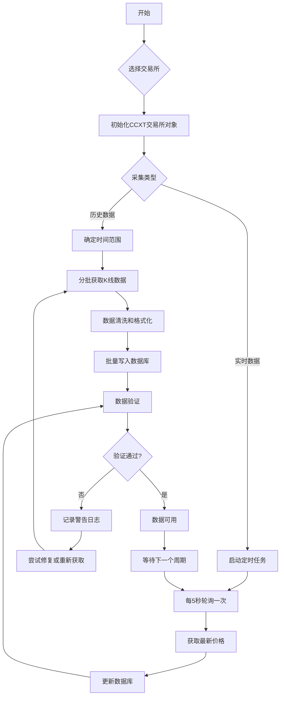
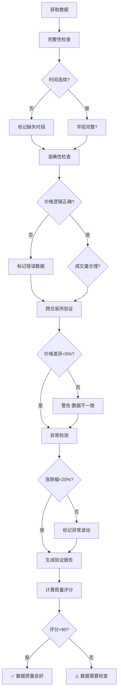
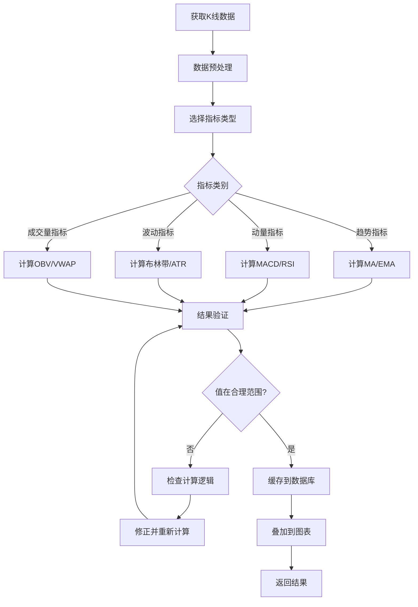
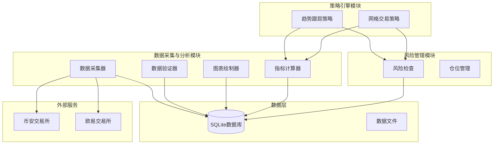
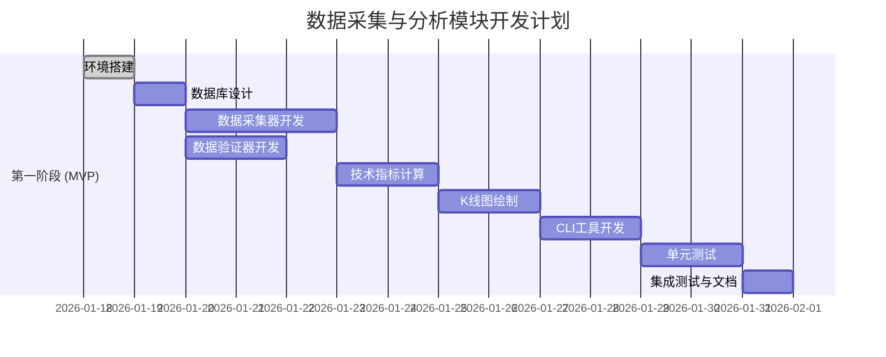

# 数据采集与分析模块 产品需求文档 (PRD)

## 文档信息
- **文档版本**: v1.0
- **创建日期**: 2026-01-18
- **产品经理**: Claude Code
- **最后更新**: 2026-01-18
- **目标用户**: 个人量化交易者(初学者水平)
- **模块定位**: 量化交易系统的数据基础模块

---

## 1. 需求概述

### 1.1 需求背景

在量化交易系统中,准确的数据是所有决策的基础。当前系统需要:
- 从币安和欧易交易所获取实时和历史数据
- 验证数据的准确性和完整性
- 可视化展示K线图和技术指标
- 为后续的策略开发提供可靠的数据支持

**核心价值:**
- 确保交易决策基于准确数据
- 通过可视化验证数据正确性
- 为策略回测和实盘交易提供数据基础

### 1.2 需求目标

**业务目标:**
- 建立稳定可靠的数据采集管道
- 提供数据准确性验证机制
- 实现专业的K线图和技术指标展示

**产品目标 (SMART原则):**
- **Specific**: 支持币安和欧易,采集K线数据并绘制图表
- **Measurable**: 数据准确率≥99.9%,采集延迟<2秒
- **Achievable**: 基于CCXT和成熟可视化库,技术可行
- **Relevant**: 为量化交易系统提供数据基础
- **Time-bound**: MVP版本2周内交付

### 1.3 目标用户

**用户画像:**
- **身份**: 量化交易系统开发者/使用者
- **经验**: 初学者水平,了解Python基础
- **核心诉求**:
  - 验证数据获取是否正确
  - 直观查看K线图和指标
  - 理解技术指标的计算方法
  - 为后续策略开发打好基础

---

## 2. 功能范围

### 2.1 核心功能 (MVP)

**第一阶段必须有:**
- ✅ K线数据采集(多时间周期)
- ✅ 实时价格采集
- ✅ 数据准确性验证
- ✅ K线图绘制(蜡烛图)
- ✅ 基础技术指标叠加(MA、EMA、MACD、RSI、布林带)
- ✅ 数据导出功能
- ✅ CLI命令行工具

### 2.2 扩展功能 (v1.1)

**第二阶段增强:**
- ⭐ 成交量分析
- ⭐ 多交易对对比
- ⭐ 自定义指标
- ⭐ 深度数据可视化
- ⭐ Web交互式界面

### 2.3 未来规划 (v2.0)

**第三阶段高级功能:**
- 🚀 实时数据流(WebSocket)
- 🚀 高级技术分析工具
- 🚀 数据预警功能
- 🚀 与策略引擎深度集成

---

## 3. 功能需求详细说明

### 3.1 数据采集模块

#### 3.1.1 功能描述

从币安和欧易交易所采集历史K线数据和实时价格数据,并存储到本地数据库。

#### 3.1.2 功能要点

**1. K线数据采集**

支持的时间周期:
- 1分钟 (1m)
- 5分钟 (5m)
- 15分钟 (15m)
- 1小时 (1h)
- 4小时 (4h)
- 1天 (1d)

采集内容:
- 开盘价 (Open)
- 最高价 (High)
- 最低价 (Low)
- 收盘价 (Close)
- 成交量 (Volume)
- 成交额 (Quote Volume)
- 时间戳 (Timestamp)

**2. 实时价格采集**

采集内容:
- 最新成交价
- 24小时涨跌幅
- 24小时最高价
- 24小时最低价
- 24小时成交量

**3. 数据同步策略**

- **历史数据**: 首次运行时批量下载,从当前时间往前推6个月
- **增量更新**: 每小时自动同步最新的K线数据
- **实时数据**: 通过轮询方式每5秒更新一次

**4. 错误处理**

- 网络错误: 自动重试3次,间隔5秒
- API限流: 智能等待,不超过交易所限制
- 数据缺失: 记录日志,尝试补全
- 异常数据: 自动过滤,记录警告

#### 3.1.3 用户故事

作为量化交易者,我希望系统能够自动从交易所获取历史K线数据,并持续更新最新数据,以便我基于准确的数据进行分析和决策。

#### 3.1.4 接口设计

```python
class DataCollector:
    """数据采集器"""

    def fetch_ohlcv(self, exchange: str, symbol: str,
                    timeframe: str, limit: int = 1000) -> pd.DataFrame:
        """
        获取K线数据

        Args:
            exchange: 交易所名称 ('binance' 或 'okx')
            symbol: 交易对 ('BTC/USDT')
            timeframe: 时间周期 ('1m', '5m', '1h', '4h', '1d')
            limit: 获取数量 (默认1000,最大1000)

        Returns:
            DataFrame: K线数据
        """

    def fetch_ticker(self, exchange: str, symbol: str) -> dict:
        """
        获取实时价格信息

        Args:
            exchange: 交易所名称
            symbol: 交易对

        Returns:
            dict: 包含最新价格、涨跌幅等信息
        """

    def sync_historical_data(self, exchange: str, symbol: str,
                            timeframe: str, days: int = 180):
        """
        同步历史数据

        Args:
            exchange: 交易所名称
            symbol: 交易对
            timeframe: 时间周期
            days: 历史天数 (默认180天)
        """

    def start_realtime_sync(self, exchange: str, symbol: str,
                           interval: int = 5):
        """
        启动实时数据同步

        Args:
            exchange: 交易所名称
            symbol: 交易对
            interval: 同步间隔(秒)
        """
```

#### 3.1.5 使用示例

```python
# 初始化数据采集器
collector = DataCollector()

# 采集历史数据
collector.sync_historical_data('binance', 'BTC/USDT', '4h', days=180)

# 获取最新100根4小时K线
df = collector.fetch_ohlcv('binance', 'BTC/USDT', '4h', limit=100)

# 获取实时价格
ticker = collector.fetch_ticker('binance', 'BTC/USDT')
print(f"最新价格: {ticker['last']}")

# 启动实时同步
collector.start_realtime_sync('binance', 'BTC/USDT', interval=5)
```

---

### 3.2 数据验证模块

#### 3.2.1 功能描述

验证从交易所获取的数据的准确性、完整性和一致性,确保数据质量。

#### 3.2.2 功能要点

**1. 数据完整性检查**

检查项:
- 时间序列连续性(不应有缺失的时间点)
- 数据字段完整性(开高低收量都不能为空)
- 数据范围合理性(价格不能为0或负数)

**2. 数据准确性检查**

检查项:
- 开盘价 ≤ 最高价
- 开盘价 ≥ 最低价
- 收盘价 ≤ 最高价
- 收盘价 ≥ 最低价
- 成交量 ≥ 0

**3. 跨交易所验证**

对比同一交易对在不同交易所的数据:
- 价格差异是否在合理范围内(考虑手续费和滑点)
- 成交量差异是否合理

**4. 数据一致性检查**

- K线时间戳对齐(应该是整点时间)
- 数据类型一致性
- 数值精度一致性

**5. 异常数据检测**

- 价格异常波动(单根K线涨跌幅>20%需要标记)
- 成交量异常(突然放大10倍以上需要标记)
- 缺口检测(开盘价与上一根收盘价差距>5%)

#### 3.2.3 验证报告

生成数据验证报告,包含:
- 数据总量统计
- 缺失数据数量和位置
- 异常数据数量和详情
- 数据质量评分(0-100分)
- 修复建议

#### 3.2.4 接口设计

```python
class DataValidator:
    """数据验证器"""

    def validate_completeness(self, df: pd.DataFrame) -> dict:
        """
        验证数据完整性

        Returns:
            dict: {
                'is_complete': bool,
                'missing_count': int,
                'missing_periods': list,
                'score': float
            }
        """

    def validate_accuracy(self, df: pd.DataFrame) -> dict:
        """
        验证数据准确性

        Returns:
            dict: {
                'is_accurate': bool,
                'error_count': int,
                'error_details': list,
                'score': float
            }
        """

    def cross_exchange_validation(self, symbol: str,
                                  timeframe: str) -> dict:
        """
        跨交易所数据验证

        Returns:
            dict: {
                'price_diff_pct': float,
                'is_consistent': bool,
                'details': dict
            }
        """

    def detect_anomalies(self, df: pd.DataFrame,
                        threshold: float = 0.2) -> pd.DataFrame:
        """
        检测异常数据

        Args:
            df: K线数据
            threshold: 异常阈值(默认20%)

        Returns:
            DataFrame: 标记了异常的数据
        """

    def generate_report(self, exchange: str, symbol: str,
                       timeframe: str) -> str:
        """
        生成数据验证报告

        Returns:
            str: Markdown格式的报告
        """
```

#### 3.2.5 使用示例

```python
# 初始化验证器
validator = DataValidator()

# 获取数据
df = collector.fetch_ohlcv('binance', 'BTC/USDT', '4h')

# 验证完整性
completeness = validator.validate_completeness(df)
print(f"数据完整性: {completeness['score']}%")
print(f"缺失数量: {completeness['missing_count']}")

# 验证准确性
accuracy = validator.validate_accuracy(df)
print(f"数据准确性: {accuracy['score']}%")
print(f"错误数量: {accuracy['error_count']}")

# 检测异常
anomalies = validator.detect_anomalies(df)
print(f"发现 {len(anomalies)} 个异常数据点")

# 跨交易所验证
cross_check = validator.cross_exchange_validation('BTC/USDT', '4h')
print(f"币安vs欧易价格差异: {cross_check['price_diff_pct']}%")

# 生成完整报告
report = validator.generate_report('binance', 'BTC/USDT', '4h')
print(report)
```

---

### 3.3 K线图绘制模块

#### 3.3.1 功能描述

基于采集的数据绘制专业的K线图,支持交互式查看和导出。

#### 3.3.2 功能要点

**1. 基础K线图**

- 蜡烛图绘制(红涨绿跌或绿涨红跌)
- 成交量柱状图(与K线图对齐)
- 坐标轴标注(价格、时间、成交量)
- 网格线
- 图例说明

**2. 图表交互**

- 鼠标悬停显示详细信息
- 缩放功能(滚轮)
- 平移功能(拖拽)
- 时间范围选择器
- 十字光标

**3. 样式定制**

- 颜色主题(深色/浅色)
- K线颜色自定义
- 图表尺寸调整
- 字体大小调整
- 网格线显示/隐藏

**4. 图表类型**

- 普通K线图
- 分时图(线图)
- 启线图(只有实体)
- 其他: 根据需求扩展

**5. 图表导出**

- 导出为PNG/JPG图片
- 导出为PDF
- 导出数据为CSV/Excel

#### 3.3.3 技术方案

**方案A: Plotly (推荐)**

优点:
- 交互性强,内置缩放、平移等功能
- 支持Web界面,适合Streamlit集成
- 图表美观,专业度高
- 社区活跃,文档丰富

缺点:
- 静态图片导出需要额外依赖

**方案B: Matplotlib**

优点:
- 成熟稳定,文档丰富
- 完全自定义控制
- 静态图导出方便

缺点:
- 交互性较差
- 代码量较大

**方案C: mplfinance (专门用于金融图表)**

优点:
- 专门为金融数据设计
- 代码简洁,开箱即用
- 支持多种技术指标

缺点:
- 自定义能力有限
- 交互性一般

**MVP推荐**: 使用 **mplfinance** 快速实现基础功能,后续升级到 **Plotly** 增强交互性。

#### 3.3.4 接口设计

```python
class ChartDrawer:
    """K线图绘制器"""

    def draw_candlestick(self, df: pd.DataFrame,
                        title: str = None,
                        style: str = 'charles') -> go.Figure:
        """
        绘制K线图

        Args:
            df: K线数据 (必须包含 open, high, low, close 列)
            title: 图表标题
            style: 图表样式 ('charles', 'nightclouds', 'yahoo'等)

        Returns:
            Figure: Plotly图表对象
        """

    def add_volume(self, fig: go.Figure,
                   df: pd.DataFrame) -> go.Figure:
        """
        添加成交量柱状图

        Args:
            fig: 图表对象
            df: K线数据

        Returns:
            Figure: 添加成交量后的图表
        """

    def add_indicator(self, fig: go.Figure,
                     indicator_name: str,
                     data: pd.Series,
                     color: str = None) -> go.Figure:
        """
        添加技术指标曲线

        Args:
            fig: 图表对象
            indicator_name: 指标名称
            data: 指标数据
            color: 线条颜色

        Returns:
            Figure: 添加指标后的图表
        """

    def save_chart(self, fig: go.Figure,
                   filename: str,
                   width: int = 1200,
                   height: int = 800):
        """
        保存图表为图片

        Args:
            fig: 图表对象
            filename: 文件名
            width: 图片宽度
            height: 图片高度
        """

    def create_subplots(self, rows: int = 2,
                       cols: int = 1) -> go.Figure:
        """
        创建多子图图表

        Args:
            rows: 行数
            cols: 列数

        Returns:
            Figure: 多子图图表对象
        """
```

#### 3.3.5 使用示例

```python
# 初始化图表绘制器
drawer = ChartDrawer()

# 获取数据
df = collector.fetch_ohlcv('binance', 'BTC/USDT', '4h', limit=100)

# 绘制基础K线图
fig = drawer.draw_candlestick(df, title='BTC/USDT 4H')

# 添加成交量
fig = drawer.add_volume(fig, df)

# 添加MA均线
fig = drawer.add_indicator(fig, 'MA20', calculate_ma(df, 20), color='blue')
fig = drawer.add_indicator(fig, 'MA50', calculate_ma(df, 50), color='orange')

# 保存图表
drawer.save_chart(fig, 'btc_usdt_4h.png')

# 在Streamlit中显示
st.plotly_chart(fig, use_container_width=True)
```

---

### 3.4 技术指标计算模块

#### 3.4.1 功能描述

计算常用技术分析指标,支持叠加到K线图上。

#### 3.4.2 支持的指标

**趋势指标:**

1. **SMA (简单移动平均)**
   - 公式: SMA = sum(close, n) / n
   - 参数: 周期n (常用: 5, 10, 20, 50, 200)
   - 用途: 识别趋势方向

2. **EMA (指数移动平均)**
   - 公式: EMA = (close - prev_EMA) * (2 / (n+1)) + prev_EMA
   - 参数: 周期n (常用: 12, 26, 50)
   - 用途: 快速响应价格变化

3. **MACD (指数平滑异同移动平均线)**
   - DIF线 = EMA(12) - EMA(26)
   - DEA线 = EMA(DIF, 9)
   - MACD柱 = (DIF - DEA) * 2
   - 用途: 趋势跟踪和动量分析

**震荡指标:**

4. **RSI (相对强弱指标)**
   - 公式: RSI = 100 - (100 / (1 + RS))
   - RS = 平均涨幅 / 平均跌幅
   - 参数: 周期14
   - 用途: 超买超卖判断

5. **KDJ (随机指标)**
   - K值、D值、J值计算
   - 参数: (9, 3, 3)
   - 用途: 短期买卖信号

**波动指标:**

6. **Bollinger Bands (布林带)**
   - 中轨 = SMA(20)
   - 上轨 = 中轨 + 2 * 标准差
   - 下轨 = 中轨 - 2 * 标准差
   - 用途: 波动范围和突破信号

7. **ATR (真实波幅)**
   - TR = max(high-low, abs(high-prev_close), abs(low-prev_close))
   - ATR = SMA(TR, 14)
   - 用途: 衡量市场波动性

**成交量指标:**

8. **VWAP (成交量加权平均价)**
   - VWAP = sum(典型价格 * 成交量) / sum(成交量)
   - 典型价格 = (high + low + close) / 3
   - 用途: 判断平均持仓成本

9. **OBV (能量潮)**
   - 若今日收盘价>昨日收盘价: OBV = 昨日OBV + 今日成交量
   - 若今日收盘价<昨日收盘价: OBV = 昨日OBV - 今日成交量
   - 用途: 资金流向分析

#### 3.4.3 接口设计

```python
class TechnicalIndicators:
    """技术指标计算器"""

    @staticmethod
    def sma(df: pd.DataFrame, period: int = 20) -> pd.Series:
        """
        计算简单移动平均线

        Args:
            df: K线数据
            period: 周期

        Returns:
            Series: SMA值
        """

    @staticmethod
    def ema(df: pd.DataFrame, period: int = 20) -> pd.Series:
        """
        计算指数移动平均线

        Args:
            df: K线数据
            period: 周期

        Returns:
            Series: EMA值
        """

    @staticmethod
    def macd(df: pd.DataFrame,
             fast: int = 12,
             slow: int = 26,
             signal: int = 9) -> pd.DataFrame:
        """
        计算MACD指标

        Returns:
            DataFrame: 包含 macd, signal, histogram 三列
        """

    @staticmethod
    def rsi(df: pd.DataFrame, period: int = 14) -> pd.Series:
        """
        计算RSI指标

        Returns:
            Series: RSI值 (0-100)
        """

    @staticmethod
    def bollinger_bands(df: pd.DataFrame,
                       period: int = 20,
                       std_dev: int = 2) -> pd.DataFrame:
        """
        计算布林带

        Returns:
            DataFrame: 包含 upper, middle, lower 三列
        """

    @staticmethod
    def atr(df: pd.DataFrame, period: int = 14) -> pd.Series:
        """
        计算真实波幅

        Returns:
            Series: ATR值
        """

    @staticmethod
    def stochastic(df: pd.DataFrame,
                  k_period: int = 14,
                  d_period: int = 3) -> pd.DataFrame:
        """
        计算KDJ指标

        Returns:
            DataFrame: 包含 k, d, j 三列
        """

    @staticmethod
    def vwap(df: pd.DataFrame) -> pd.Series:
        """
        计算成交量加权平均价

        Returns:
            Series: VWAP值
        """

    @staticmethod
    def obv(df: pd.DataFrame) -> pd.Series:
        """
        计算能量潮

        Returns:
            Series: OBV值
        """
```

#### 3.4.4 使用示例

```python
# 初始化指标计算器
ti = TechnicalIndicators()

# 获取数据
df = collector.fetch_ohlcv('binance', 'BTC/USDT', '4h')

# 计算各种指标
df['MA20'] = ti.sma(df, 20)
df['MA50'] = ti.sma(df, 50)
df['EMA12'] = ti.ema(df, 12)
df['EMA26'] = ti.ema(df, 26)

# 计算MACD
macd_data = ti.macd(df)
df['MACD'] = macd_data['macd']
df['Signal'] = macd_data['signal']
df['Histogram'] = macd_data['histogram']

# 计算RSI
df['RSI'] = ti.rsi(df)

# 计算布林带
bb = ti.bollinger_bands(df)
df['BB_Upper'] = bb['upper']
df['BB_Middle'] = bb['middle']
df['BB_Lower'] = bb['lower']

# 计算ATR
df['ATR'] = ti.atr(df)

# 查看结果
print(df[['timestamp', 'close', 'MA20', 'RSI', 'MACD']].tail())
```

---

### 3.5 CLI命令行工具

#### 3.5.1 功能描述

提供命令行界面,方便用户快速采集数据、验证数据和查看图表。

#### 3.5.2 命令列表

**数据采集命令:**

```bash
# 同步历史数据
python main.py data collect --exchange binance --symbol BTC/USDT --timeframe 4h --days 180

# 启动实时数据同步
python main.py data sync --exchange binance --symbol BTC/USDT --interval 5

# 查看数据统计
python main.py data stats --exchange binance --symbol BTC/USDT --timeframe 4h
```

**数据验证命令:**

```bash
# 验证数据质量
python main.py data validate --exchange binance --symbol BTC/USDT --timeframe 4h

# 跨交易所验证
python main.py data compare --symbol BTC/USDT --timeframe 4h

# 生成验证报告
python main.py data report --exchange binance --symbol BTC/USDT --timeframe 4h --output report.md
```

**图表绘制命令:**

```bash
# 绘制K线图
python main.py chart draw --exchange binance --symbol BTC/USDT --timeframe 4h --limit 100

# 添加指标
python main.py chart draw --exchange binance --symbol BTC/USDT --timeframe 4h \
    --indicators MA20,MA50,RSI,MACD

# 保存图表
python main.py chart draw --exchange binance --symbol BTC/USDT --timeframe 4h \
    --output btc_chart.png

# 对比两个交易所
python main.py chart compare --symbol BTC/USDT --timeframe 4h
```

**指标计算命令:**

```bash
# 计算单个指标
python main.py indicator calc --exchange binance --symbol BTC/USDT --timeframe 4h \
    --indicator MACD --periods 12,26,9

# 查看所有可用指标
python main.py indicator list

# 批量计算指标
python main.py indicator batch --exchange binance --symbol BTC/USDT --timeframe 4h \
    --indicators SMA,EMA,RSI,MACD,BB
```

**数据导出命令:**

```bash
# 导出为CSV
python main.py data export --exchange binance --symbol BTC/USDT --timeframe 4h \
    --format csv --output btc_data.csv

# 导出为Excel
python main.py data export --exchange binance --symbol BTC/USDT --timeframe 4h \
    --format excel --output btc_data.xlsx

# 导出包含指标的数据
python main.py data export --exchange binance --symbol BTC/USDT --timeframe 4h \
    --indicators MA20,RSI,MACD --format excel --output btc_with_indicators.xlsx
```

#### 3.5.3 实现框架

使用 Click 库构建 CLI:

```python
import click

@click.group()
def cli():
    """数据采集与分析工具"""
    pass

@cli.group()
def data():
    """数据管理"""
    pass

@data.command()
@click.option('--exchange', required=True, help='交易所名称')
@click.option('--symbol', required=True, help='交易对')
@click.option('--timeframe', required=True, help='时间周期')
@click.option('--days', default=180, help='历史天数')
def collect(exchange, symbol, timeframe, days):
    """同步历史数据"""
    collector = DataCollector()
    collector.sync_historical_data(exchange, symbol, timeframe, days)
    click.echo(f"✅ 已同步 {symbol} {timeframe} 最近{days}天的数据")

@data.command()
@click.option('--exchange', required=True)
@click.option('--symbol', required=True)
@click.option('--timeframe', required=True)
def validate(exchange, symbol, timeframe):
    """验证数据质量"""
    validator = DataValidator()
    df = load_data(exchange, symbol, timeframe)

    completeness = validator.validate_completeness(df)
    accuracy = validator.validate_accuracy(df)

    click.echo(f"数据完整性: {completeness['score']}%")
    click.echo(f"数据准确性: {accuracy['score']}%")

@cli.group()
def chart():
    """图表绘制"""
    pass

@chart.command()
@click.option('--exchange', required=True)
@click.option('--symbol', required=True)
@click.option('--timeframe', default='4h', help='时间周期')
@click.option('--limit', default=100, help='K线数量')
@click.option('--indicators', default='', help='指标列表(逗号分隔)')
@click.option('--output', default=None, help='输出文件名')
def draw(exchange, symbol, timeframe, limit, indicators, output):
    """绘制K线图"""
    # 实现逻辑
    pass

if __name__ == '__main__':
    cli()
```

---

## 4. 技术实现方案

### 4.1 技术栈

| 类别 | 技术选型 | 版本 | 说明 |
|------|----------|------|------|
| 编程语言 | Python | 3.11+ | 主开发语言 |
| 交易所接口 | CCXT | 4.0+ | 统一交易所API |
| 数据处理 | Pandas | 2.1+ | 数据处理核心库 |
| 数值计算 | NumPy | 1.24+ | 数组计算 |
| 数据库 | SQLite | 3.x | 本地数据存储 |
| ORM | SQLAlchemy | 2.0+ | 数据库操作 |
| 图表绘制 | mplfinance | 0.12+ | 金融图表专用库 |
| 图表绘制 | Plotly | 5.18+ | 交互式图表 |
| Web框架 | Streamlit | 1.28+ | 可视化界面(可选) |
| CLI框架 | Click | 8.1+ | 命令行工具 |
| 配置管理 | PyYAML | 6.0+ | 配置文件 |
| 日志管理 | Loguru | 0.7+ | 日志记录 |

### 4.2 目录结构

```
ntV1/
├── src/
│   ├── data/
│   │   ├── __init__.py
│   │   ├── collector.py          # 数据采集器
│   │   ├── validator.py          # 数据验证器
│   │   ├── chart.py              # 图表绘制器
│   │   ├── indicators.py         # 技术指标计算
│   │   ├── database.py           # 数据库操作
│   │   └── models.py             # 数据模型
│   ├── cli/
│   │   ├── __init__.py
│   │   └── data_cli.py           # 数据相关CLI命令
│   └── utils/
│       ├── __init__.py
│       └── helpers.py            # 辅助函数
├── data/
│   ├── history/                  # 历史数据文件
│   └── cache/                    # 缓存数据
├── config/
│   └── data_config.yaml          # 数据模块配置
├── tests/
│   ├── test_collector.py
│   ├── test_validator.py
│   ├── test_chart.py
│   └── test_indicators.py
└── docs/
    └── requirements/
        └── data_collection_analysis.md  # 本文档
```

### 4.3 数据库设计

#### 4.3.1 表结构

**表1: klines (K线数据)**

```sql
CREATE TABLE klines (
    id INTEGER PRIMARY KEY AUTOINCREMENT,
    exchange VARCHAR(20) NOT NULL,        -- 交易所: binance, okx
    symbol VARCHAR(20) NOT NULL,          -- 交易对: BTC/USDT
    timeframe VARCHAR(10) NOT NULL,       -- 周期: 1m, 5m, 1h, 4h, 1d
    timestamp INTEGER NOT NULL,           -- 时间戳(毫秒)
    open DECIMAL(20, 8) NOT NULL,         -- 开盘价
    high DECIMAL(20, 8) NOT NULL,         -- 最高价
    low DECIMAL(20, 8) NOT NULL,          -- 最低价
    close DECIMAL(20, 8) NOT NULL,        -- 收盘价
    volume DECIMAL(20, 8) NOT NULL,       -- 成交量(基础币)
    quote_volume DECIMAL(20, 8),          -- 成交额(计价币)
    trades_count INTEGER,                 -- 成交笔数
    created_at TIMESTAMP DEFAULT CURRENT_TIMESTAMP,
    UNIQUE(exchange, symbol, timeframe, timestamp)
);

-- 索引优化查询性能
CREATE INDEX idx_klines_lookup ON klines(exchange, symbol, timeframe, timestamp);
CREATE INDEX idx_klines_time ON klines(timestamp);
```

**表2: tickers (实时价格)**

```sql
CREATE TABLE tickers (
    id INTEGER PRIMARY KEY AUTOINCREMENT,
    exchange VARCHAR(20) NOT NULL,
    symbol VARCHAR(20) NOT NULL,
    last_price DECIMAL(20, 8),            -- 最新价格
    bid_price DECIMAL(20, 8),             -- 买一价
    ask_price DECIMAL(20, 8),             -- 卖一价
    high_24h DECIMAL(20, 8),              -- 24小时最高价
    low_24h DECIMAL(20, 8),               -- 24小时最低价
    volume_24h DECIMAL(20, 8),            -- 24小时成交量
    change_24h DECIMAL(10, 4),            -- 24小时涨跌额
    change_pct_24h DECIMAL(10, 4),        -- 24小时涨跌幅
    timestamp INTEGER NOT NULL,
    created_at TIMESTAMP DEFAULT CURRENT_TIMESTAMP,
    UNIQUE(exchange, symbol, timestamp)
);

CREATE INDEX idx_tickers_lookup ON tickers(exchange, symbol, timestamp);
```

**表3: indicators (技术指标缓存)**

```sql
CREATE TABLE indicators (
    id INTEGER PRIMARY KEY AUTOINCREMENT,
    exchange VARCHAR(20) NOT NULL,
    symbol VARCHAR(20) NOT NULL,
    timeframe VARCHAR(10) NOT NULL,
    indicator_name VARCHAR(20) NOT NULL,  -- 指标名称: MA20, RSI, etc.
    timestamp INTEGER NOT NULL,
    value DECIMAL(20, 8),                 -- 指标值
    params JSON,                          -- 指标参数
    created_at TIMESTAMP DEFAULT CURRENT_TIMESTAMP,
    UNIQUE(exchange, symbol, timeframe, indicator_name, timestamp)
);

CREATE INDEX idx_indicators_lookup ON indicators(exchange, symbol, timeframe, indicator_name, timestamp);
```

**表4: data_validation_log (数据验证日志)**

```sql
CREATE TABLE data_validation_log (
    id INTEGER PRIMARY KEY AUTOINCREMENT,
    exchange VARCHAR(20) NOT NULL,
    symbol VARCHAR(20) NOT NULL,
    timeframe VARCHAR(10) NOT NULL,
    validation_type VARCHAR(20) NOT NULL, -- completeness, accuracy, anomaly
    result JSON,                          -- 验证结果详情
    score DECIMAL(5, 2),                  -- 质量评分
    created_at TIMESTAMP DEFAULT CURRENT_TIMESTAMP
);
```

#### 4.3.2 数据模型

```python
from sqlalchemy import create_engine, Column, Integer, String, DECIMAL, JSON, TIMESTAMP
from sqlalchemy.ext.declarative import declarative_base
from sqlalchemy.orm import sessionmaker

Base = declarative_base()

class Kline(Base):
    """K线数据模型"""
    __tablename__ = 'klines'

    id = Column(Integer, primary_key=True)
    exchange = Column(String(20), nullable=False)
    symbol = Column(String(20), nullable=False)
    timeframe = Column(String(10), nullable=False)
    timestamp = Column(Integer, nullable=False)
    open = Column(DECIMAL(20, 8), nullable=False)
    high = Column(DECIMAL(20, 8), nullable=False)
    low = Column(DECIMAL(20, 8), nullable=False)
    close = Column(DECIMAL(20, 8), nullable=False)
    volume = Column(DECIMAL(20, 8), nullable=False)
    quote_volume = Column(DECIMAL(20, 8))
    trades_count = Column(Integer)

    def to_dict(self):
        return {
            'timestamp': self.timestamp,
            'open': float(self.open),
            'high': float(self.high),
            'low': float(self.low),
            'close': float(self.close),
            'volume': float(self.volume)
        }

class Ticker(Base):
    """实时价格模型"""
    __tablename__ = 'tickers'

    id = Column(Integer, primary_key=True)
    exchange = Column(String(20), nullable=False)
    symbol = Column(String(20), nullable=False)
    last_price = Column(DECIMAL(20, 8))
    bid_price = Column(DECIMAL(20, 8))
    ask_price = Column(DECIMAL(20, 8))
    high_24h = Column(DECIMAL(20, 8))
    low_24h = Column(DECIMAL(20, 8))
    volume_24h = Column(DECIMAL(20, 8))
    change_24h = Column(DECIMAL(10, 4))
    change_pct_24h = Column(DECIMAL(10, 4))
    timestamp = Column(Integer, nullable=False)

class Indicator(Base):
    """技术指标模型"""
    __tablename__ = 'indicators'

    id = Column(Integer, primary_key=True)
    exchange = Column(String(20), nullable=False)
    symbol = Column(String(20), nullable=False)
    timeframe = Column(String(10), nullable=False)
    indicator_name = Column(String(20), nullable=False)
    timestamp = Column(Integer, nullable=False)
    value = Column(DECIMAL(20, 8))
    params = Column(JSON)

class ValidationLog(Base):
    """数据验证日志模型"""
    __tablename__ = 'data_validation_log'

    id = Column(Integer, primary_key=True)
    exchange = Column(String(20), nullable=False)
    symbol = Column(String(20), nullable=False)
    timeframe = Column(String(10), nullable=False)
    validation_type = Column(String(20), nullable=False)
    result = Column(JSON)
    score = Column(DECIMAL(5, 2))

# 数据库连接
DATABASE_URL = "sqlite:///data/trading.db"
engine = create_engine(DATABASE_URL)
Session = sessionmaker(bind=engine)

def init_db():
    """初始化数据库"""
    Base.metadata.create_all(engine)
```

### 4.4 数据采集流程



### 4.5 数据验证流程



### 4.6 技术指标计算流程



---

## 5. 与现有系统集成

### 5.1 系统架构定位



### 5.2 接口集成

**为策略引擎提供数据接口:**

```python
class DataService:
    """数据服务 - 为策略引擎提供统一的数据接口"""

    def __init__(self):
        self.collector = DataCollector()
        self.validator = DataValidator()
        self.indicators = TechnicalIndicators()

    def get_bars(self, symbol: str, timeframe: str,
                 limit: int = 100) -> pd.DataFrame:
        """
        获取K线数据(策略调用)

        Args:
            symbol: 交易对
            timeframe: 时间周期
            limit: 数量

        Returns:
            DataFrame: 包含开高低收量数据
        """
        # 优先从数据库读取
        df = self.load_from_db(symbol, timeframe, limit)

        # 如果数据不足,从交易所获取
        if df is None or len(df) < limit:
            df = self.collector.fetch_ohlcv('binance', symbol, timeframe, limit)
            self.save_to_db(df, symbol, timeframe)

        return df

    def get_indicator(self, symbol: str, timeframe: str,
                     indicator: str, **params) -> pd.Series:
        """
        获取技术指标(策略调用)

        Args:
            symbol: 交易对
            timeframe: 时间周期
            indicator: 指标名称
            **params: 指标参数

        Returns:
            Series: 指标值
        """
        # 先尝试从缓存读取
        cached = self.load_indicator_from_cache(symbol, timeframe, indicator, params)
        if cached is not None:
            return cached

        # 计算指标
        df = self.get_bars(symbol, timeframe)
        if indicator == 'SMA':
            return self.indicators.sma(df, params.get('period', 20))
        elif indicator == 'EMA':
            return self.indicators.ema(df, params.get('period', 20))
        elif indicator == 'MACD':
            return self.indicators.macd(df)
        elif indicator == 'RSI':
            return self.indicators.rsi(df)
        # ... 更多指标

    def validate_data(self, symbol: str, timeframe: str) -> bool:
        """
        验证数据质量(策略调用)

        Returns:
            bool: 数据是否可用
        """
        df = self.get_bars(symbol, timeframe)
        completeness = self.validator.validate_completeness(df)
        accuracy = self.validator.validate_accuracy(df)

        return completeness['score'] >= 90 and accuracy['score'] >= 90
```

### 5.3 配置文件

**config/data_config.yaml**

```yaml
# 数据采集配置
data_collection:
  # 支持的交易所
  exchanges:
    - name: binance
      enabled: true
      api_key: ${BINANCE_API_KEY}
      api_secret: ${BINANCE_API_SECRET}
      rate_limit: 1200  # 每分钟请求限制

    - name: okx
      enabled: true
      api_key: ${OKX_API_KEY}
      api_secret: ${OKX_API_SECRET}
      passphrase: ${OKX_PASSPHRASE}
      rate_limit: 600

  # 采集的交易对
  symbols:
    - BTC/USDT
    - ETH/USDT
    - BNB/USDT

  # 采集的时间周期
  timeframes:
    - 1m
    - 5m
    - 15m
    - 1h
    - 4h
    - 1d

  # 数据保留策略
  retention:
    klines: 180  # K线数据保留180天
    tickers: 7   # 实时价格保留7天

  # 同步策略
  sync:
    historical_days: 180  # 首次同步180天历史数据
    realtime_interval: 5  # 实时数据每5秒同步
    batch_size: 1000      # 批量获取1000条

# 数据验证配置
data_validation:
  # 完整性检查
  completeness:
    allow_gaps: false     # 是否允许时间缺失
    max_gap_hours: 24     # 最大允许缺失时长

  # 准确性检查
  accuracy:
    check_ohlc_logic: true  # 检查开高低收逻辑
    min_price: 0.0001       # 最低价格
    max_change_pct: 0.5     # 最大单根涨跌幅(50%)

  # 跨交易所验证
  cross_exchange:
    enabled: true
    max_price_diff_pct: 0.05  # 最大价格差异(5%)

  # 异常检测
  anomaly_detection:
    enabled: true
    change_threshold: 0.2     # 异常波动阈值(20%)
    volume_spike_threshold: 10  # 成交量异常倍数

# 图表配置
chart:
  # 默认样式
  default_style: charles  # mplfinance样式

  # 颜色主题
  colors:
    up: '#26a69a'      # 涨(绿色)
    down: '#ef5350'    # 跌(红色)
    background: '#1e1e1e'  # 背景色
    grid: '#444444'    # 网格线

  # 图表尺寸
  size:
    width: 1200
    height: 800

  # 导出设置
  export:
    format: png  # png, jpg, pdf
    dpi: 100     # 图片分辨率

# 技术指标配置
indicators:
  # 趋势指标
  trend:
    SMA:
      default_periods: [5, 10, 20, 50, 200]
    EMA:
      default_periods: [12, 26, 50]
    MACD:
      fast: 12
      slow: 26
      signal: 9

  # 震荡指标
  oscillator:
    RSI:
      period: 14
      overbought: 70
      oversold: 30
    KDJ:
      k_period: 14
      d_period: 3
      j_period: 3

  # 波动指标
  volatility:
    BB:
      period: 20
      std_dev: 2
    ATR:
      period: 14

  # 缓存设置
  cache:
    enabled: true
    ttl: 3600  # 缓存1小时
```

---

## 6. 开发计划

### 6.1 里程碑

**第一阶段: MVP (2周)**

目标: 实现基础数据采集、验证和图表绘制功能



### 6.2 任务分解

**Week 1: 核心功能开发**

| 任务 | 工作量 | 负责人 | 产出物 |
|------|--------|--------|--------|
| 环境搭建与依赖安装 | 0.5天 | | 虚拟环境、依赖库 |
| 数据库设计与初始化 | 1天 | | 表结构、ORM模型 |
| DataCollector实现 | 2天 | | 数据采集器 |
| DataValidator实现 | 1.5天 | | 数据验证器 |
| TechnicalIndicators实现 | 1.5天 | | 指标计算器 |
| ChartDrawer实现(mplfinance) | 1天 | | 图表绘制器 |
| CLI基础命令 | 1天 | | 命令行工具 |

**Week 2: 测试与文档**

| 任务 | 工作量 | 负责人 | 产出物 |
|------|--------|--------|--------|
| 单元测试编写 | 2天 | | 测试用例 |
| 集成测试 | 1天 | | 测试报告 |
| 用户文档编写 | 1天 | | 使用手册 |
| API文档生成 | 0.5天 | | API文档 |
| Bug修复与优化 | 1.5天 | | 稳定版本 |

### 6.3 验收标准

**功能验收:**

- ✅ 能够从币安和欧易采集K线数据
- ✅ 数据验证能检测出缺失和错误数据
- ✅ 能绘制标准的K线图(蜡烛图)
- ✅ 能计算至少5种常用技术指标
- ✅ CLI工具能执行基本操作
- ✅ 数据能正确存储到数据库

**质量验收:**

- ✅ 单元测试覆盖率 ≥ 70%
- ✅ 所有核心功能有文档注释
- ✅ 数据采集成功率 ≥ 99%
- ✅ 图表渲染时间 < 2秒
- ✅ 无Critical级别bug

### 6.4 快速开始示例

**安装依赖:**

```bash
pip install ccxt pandas numpy sqlalchemy mplfinance plotly loguru click pyyaml
```

**初始化数据库:**

```python
from src.data.database import init_db

init_db()
print("✅ 数据库初始化完成")
```

**首次数据采集:**

```bash
# 采集BTC/USDT 4小时K线,最近180天
python main.py data collect --exchange binance --symbol BTC/USDT --timeframe 4h --days 180
```

**验证数据:**

```bash
python main.py data validate --exchange binance --symbol BTC/USDT --timeframe 4h
```

**绘制K线图:**

```bash
# 基础K线图
python main.py chart draw --exchange binance --symbol BTC/USDT --timeframe 4h --limit 100

# 带指标的K线图
python main.py chart draw --exchange binance --symbol BTC/USDT --timeframe 4h \
    --indicators MA20,MA50,RSI,MACD --output btc_chart.png
```

**计算指标:**

```python
from src.data.collector import DataCollector
from src.data.indicators import TechnicalIndicators

# 获取数据
collector = DataCollector()
df = collector.fetch_ohlcv('binance', 'BTC/USDT', '4h', limit=100)

# 计算指标
ti = TechnicalIndicators()
df['MA20'] = ti.sma(df, 20)
df['RSI'] = ti.rsi(df)
macd = ti.macd(df)
df['MACD'] = macd['macd']

# 查看结果
print(df[['timestamp', 'close', 'MA20', 'RSI', 'MACD']].tail())
```

---

## 7. 非功能需求

### 7.1 性能要求

| 指标 | 要求 | 说明 |
|------|------|------|
| 数据采集延迟 | < 2秒 | 单次API请求 |
| 图表渲染时间 | < 2秒 | 100根K线+指标 |
| 数据库查询 | < 1秒 | 10万条数据 |
| 内存占用 | < 500MB | 正常运行 |
| 指标计算 | < 0.5秒 | 单个指标 |

### 7.2 可靠性要求

- 数据采集成功率 ≥ 99%
- 网络异常自动重试3次
- 数据库事务保证一致性
- 异常情况详细日志记录

### 7.3 可用性要求

- CLI命令清晰易懂
- 错误提示友好明确
- 提供使用示例和文档
- 代码有详细注释

### 7.4 可维护性要求

- 模块化设计,低耦合
- 遵循PEP 8代码规范
- 关键函数有类型注解
- 单元测试覆盖率 ≥ 70%

---

## 8. 风险评估

### 8.1 技术风险

| 风险 | 影响 | 概率 | 应对措施 |
|------|------|------|----------|
| API限流 | 中 | 高 | 实现请求队列,控制频率 |
| 网络不稳定 | 中 | 中 | 多重重试机制,断点续传 |
| 数据质量问题 | 高 | 中 | 完善验证逻辑,异常检测 |
| 第三方库bug | 低 | 低 | 选择成熟稳定的库 |

### 8.2 业务风险

| 风险 | 影响 | 概率 | 应对措施 |
|------|------|------|----------|
| 数据不准确 | 高 | 中 | 跨交易所验证 |
| 性能不达标 | 中 | 低 | 优化查询和缓存 |
| 需求变更 | 中 | 中 | 模块化设计,灵活扩展 |

---

## 9. 成功指标

### 9.1 技术指标

- 数据采集成功率 ≥ 99%
- 数据准确率 ≥ 99.9%
- 单元测试覆盖率 ≥ 70%
- 代码符合PEP 8规范

### 9.2 功能指标

- 支持2个交易所(币安、欧易)
- 支持5种时间周期(1m, 5m, 1h, 4h, 1d)
- 支持8种技术指标(MA, EMA, MACD, RSI, KDJ, BB, ATR, OBV)
- CLI命令 ≥ 10个

### 9.3 用户体验指标

- CLI命令易用性: 用户能在5分钟内完成首次数据采集
- 文档完整性: 每个功能都有使用示例
- 错误提示清晰度: 错误信息能指导用户解决问题

---

## 10. 后续优化方向

### 10.1 v1.1 计划

**实时性提升:**
- 使用WebSocket实时推送数据
- 减少延迟至毫秒级

**交互性增强:**
- 开发Web界面(Streamlit/Plotly Dash)
- 支持交互式图表操作

**功能扩展:**
- 支持更多技术指标
- 添加形态识别功能
- 支持自定义指标公式

### 10.2 v2.0 愿景

**高级分析:**
- 机器学习预测
- 情绪分析
- 链上数据集成

**策略集成:**
- 直接从图表生成交易信号
- 回测结果可视化
- 策略参数优化

**多维度对比:**
- 多交易对对比分析
- 多交易所价格监控
- 历史数据回放

---

## 11. 附录

### 11.1 常用技术指标参考

**移动平均线 (MA):**
- SMA(5): 短期趋势
- SMA(20): 中期趋势
- SMA(50): 中长期趋势
- SMA(200): 长期趋势

**MACD参数:**
- 快线: 12
- 慢线: 26
- 信号线: 9

**RSI参数:**
- 周期: 14
- 超买区: > 70
- 超卖区: < 30

**布林带参数:**
- 周期: 20
- 标准差倍数: 2

### 11.2 数据质量检查清单

- [ ] 时间序列连续无缺失
- [ ] 开盘价 ≤ 最高价
- [ ] 收盘价 ≥ 最低价
- [ ] 成交量 ≥ 0
- [ ] 价格不为0或负数
- [ ] 涨跌幅在合理范围(< 50%)
- [ ] 跨交易所价格差异 < 5%

### 11.3 CCXT使用参考

```python
import ccxt

# 初始化交易所
exchange = ccxt.binance({
    'apiKey': 'your_key',
    'secret': 'your_secret',
    'enableRateLimit': True,
})

# 获取K线数据
bars = exchange.fetch_ohlcv('BTC/USDT', '4h', limit=100)

# 获取实时价格
ticker = exchange.fetch_ticker('BTC/USDT')
```

### 11.4 mplfinance样式参考

```python
import mplfinance as mpf

# 可用样式
styles = ['nightclouds', 'binanceday', 'yahoo', 'charles',
          'starsandstripes', 'brasil', 'default']

# 自定义颜色
mc = mpf.make_marketcolors(up='g', down='r', edge='inherit',
                           wick='inherit', volume='in')
s = mpf.make_mpf_style(marketcolors=mc)

# 绘图
mpf.plot(df, type='candle', style=s, volume=True)
```

### 11.5 常见问题 (FAQ)

**Q1: 数据采集很慢怎么办?**
A: 使用批量获取(limit=1000),避免频繁小批量请求。

**Q2: 数据有缺失怎么办?**
A: 检查网络连接,使用重试机制,或分时段重新采集。

**Q3: 指标计算结果不正确?**
A: 检查数据质量,确保输入数据完整准确。

**Q4: 图表渲染很慢?**
A: 减少K线数量,使用数据聚合(如将1m聚合为5m)。

**Q5: 如何添加自定义指标?**
A: 继承TechnicalIndicators类,添加自定义计算方法。

---

## 12. 总结

本PRD文档定义了数据采集与分析模块的核心需求,重点关注:

1. **数据准确性**: 通过多层验证确保数据质量
2. **可视化展示**: 使用专业金融图表库绘制K线图
3. **技术指标**: 支持常用技术分析指标的计算和展示
4. **易用性**: 提供CLI工具,简化操作流程

**MVP目标**: 2周内实现基础功能,为量化交易系统提供可靠的数据基础。

**核心价值**: 确保交易决策基于准确、完整、可视化的数据。

---

**文档结束**

如有疑问或需要进一步澄清,请随时提出。
