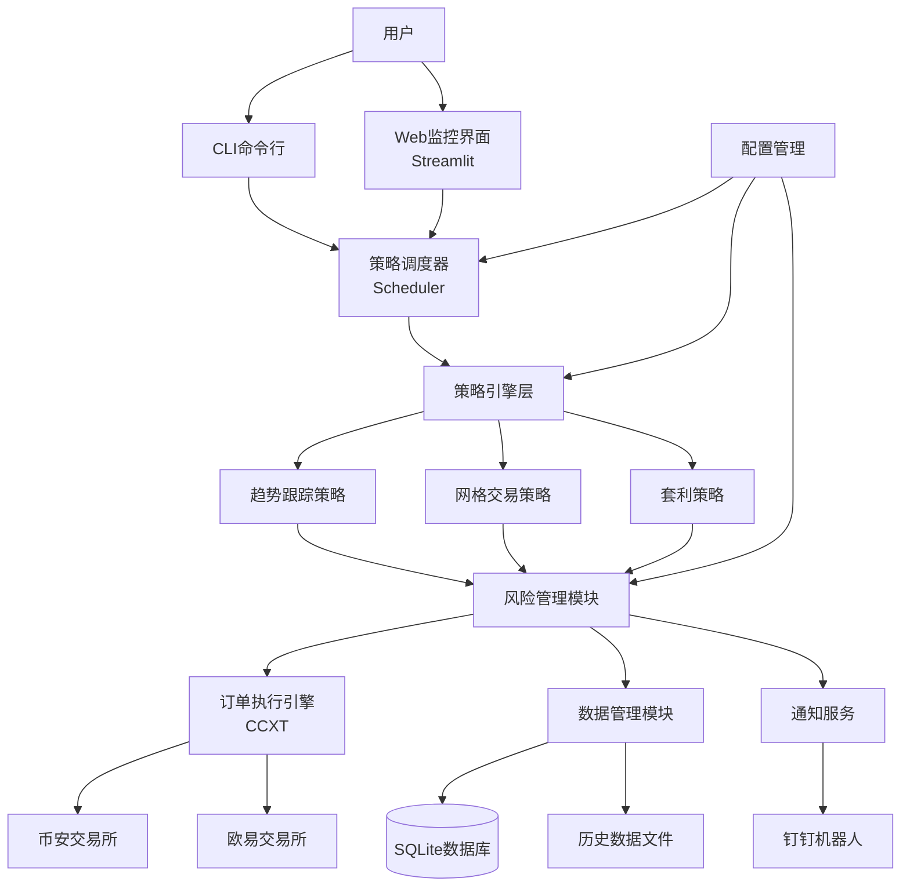
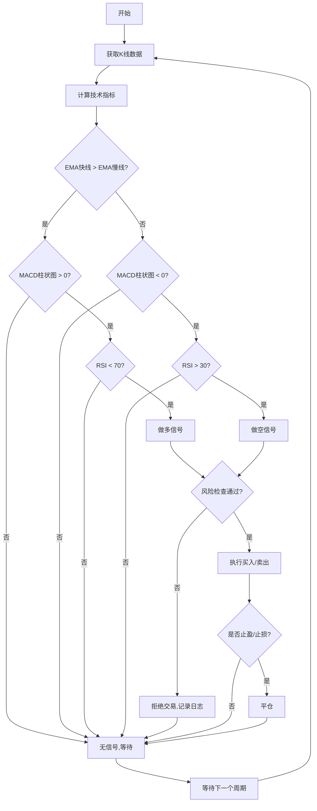
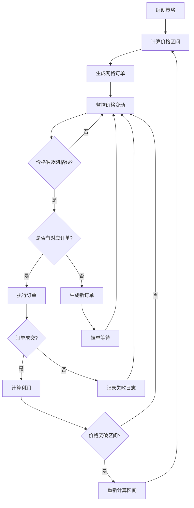
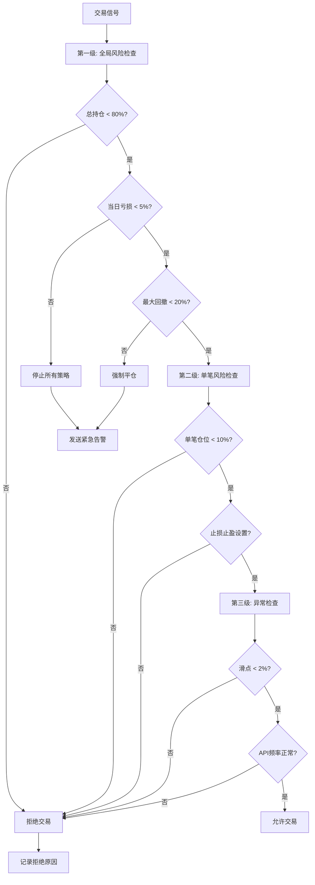
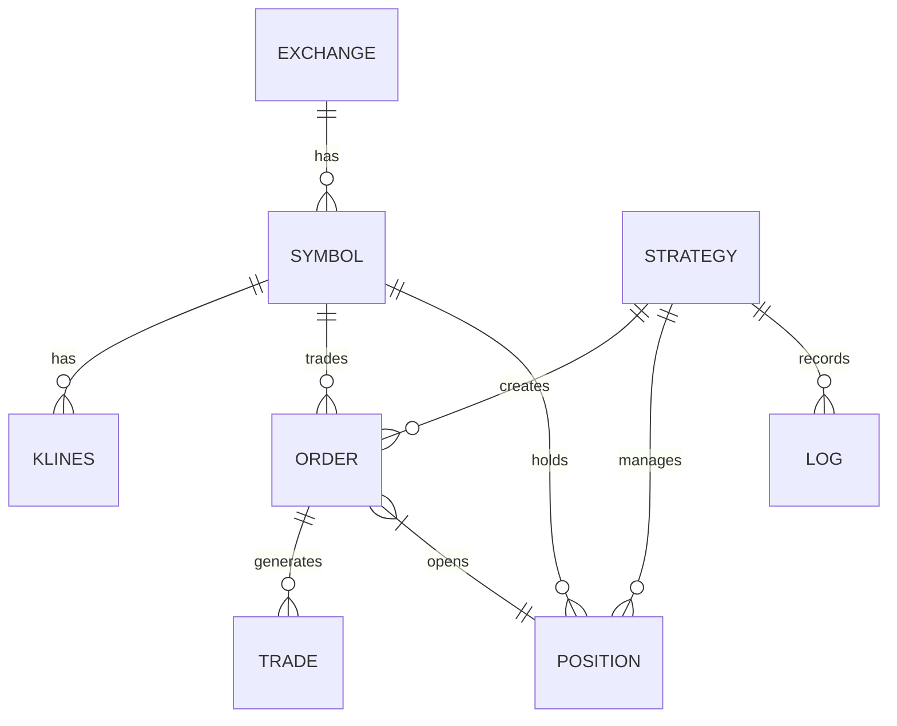
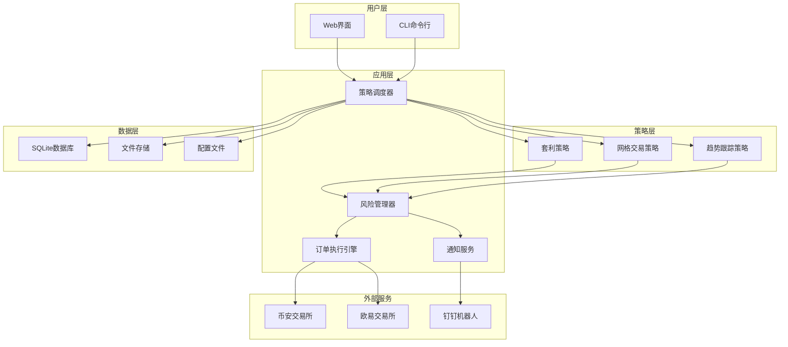
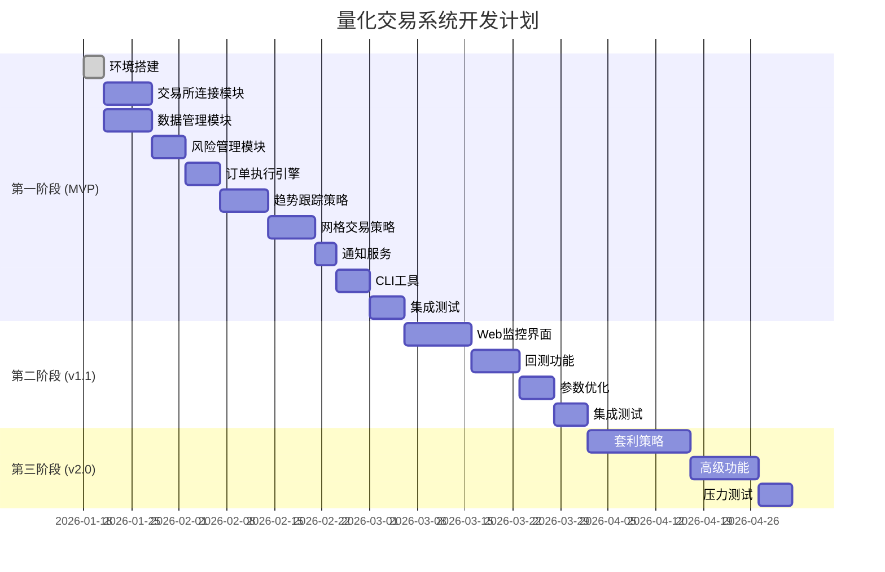

# 加密货币量化交易系统 产品需求文档 (PRD)

## 文档信息
- **文档版本**: v1.0
- **创建日期**: 2026-01-18
- **产品经理**: Claude Code
- **最后更新**: 2026-01-18
- **目标用户**: 个人量化交易者(初学者水平)

---

## 1. 需求概述

### 1.1 需求背景
加密货币市场24/7不间断交易,人工监控和操作难以保证效率和准确性。个人投资者希望通过自动化交易系统实现:
- 解放人力,避免长时间盯盘
- 通过量化策略克服情绪干扰
- 提高交易执行速度和精度
- 实现稳定收益

当前市场上的量化交易平台要么过于复杂(学习成本高),要么功能受限(灵活性差)。初学者需要一个**简单易用、功能完整、安全可靠**的个人量化交易系统。

### 1.2 需求目标

**业务目标:**
- 实现加密货币交易的自动化执行
- 支持多策略、多交易所的灵活配置
- 提供完善的风险控制机制
- 降低量化交易的学习和使用门槛

**产品目标 (SMART原则):**
- **Specific**: 支持币安和欧易两大主流交易所,提供3种基础策略
- **Measurable**: 系统可用性达到99%,订单执行延迟<1秒
- **Achievable**: 基于成熟的CCXT库和Python生态,技术可行
- **Relevant**: 满足个人投资者24/7自动交易需求
- **Time-bound**: 分3个阶段迭代,MVP版本3个月内交付

### 1.3 目标用户

**用户画像:**
- **身份**: 个人加密货币投资者
- **经验**: 初学者水平,了解基本的Python编程
- **交易经验**: 有一定的加密货币交易经验,但缺乏量化背景
- **技术能力**: 能够使用命令行,理解基本的配置文件
- **使用场景**: 家庭电脑或云服务器部署,24/7运行
- **核心诉求**: 系统稳定、易于配置、风险可控

---

## 2. 专业建议与推荐方案

基于初学者背景,以下是我的专业建议:

### 2.1 交易策略建议

#### **趋势跟踪策略**
**推荐方案: 双均线 + MACD组合**
- **原因**: 指标简单易懂,信号明确,适合初学者
- **具体实现**:
  - 主指标: EMA(快线12) + EMA(慢线26) + MACD
  - 确认指标: RSI(14) 避免超买超买区
  - 交易周期: 4小时K线(平衡信号频率和噪音)
  - 入场条件:
    - 做多: EMA快线上穿慢线 AND MACD柱状图>0 AND RSI<70
    - 做空: EMA快线下穿慢线 AND MACD柱状图<0 AND RSI>30
  - 出场条件: 止盈/止损触发 或 反向信号
  - 仓位: 每次使用总资金的10%

#### **网格交易策略**
**推荐方案: 中性网格**
- **原因**: 策略逻辑简单,适合震荡行情,风险可控
- **具体实现**:
  - 网格类型: 等差网格(价格区间均匀分布)
  - 网格数量: 20格(平衡精度和滑点成本)
  - 价格区间: 基于过去7天最高最低价自动计算
  - 单格投入: 总资金的50% / 20 = 2.5%/格
  - 利润目标: 单格利润率0.5-1%(根据交易对调整)
  - 动态调整: 当价格突破区间±20%时重新计算网格

#### **套利策略**
**推荐方案: 跨交易所套利(简化版)**
- **原因**: 逻辑简单明了,风险相对较低
- **具体实现**:
  - 监控对: 币安 vs 欧易的主流交易对(BTC/USDT, ETH/USDT等)
  - 价差阈值: >0.5% (考虑手续费后的净利润)
  - 执行方式: 同时在两个交易所下反向订单(需两边都有资金)
  - 风险控制: 单次套利资金≤总资金的20%
  - 注意: 初学者建议从"期现套利"开始,资金利用率更高

**MVP阶段建议**: 优先实现趋势跟踪和网格交易,套利策略作为v2.0功能。

### 2.2 风险管理建议

#### **三级风险控制体系**

**第一级: 全局风险控制**
- 最大总持仓: 80%资金(保留20%备用金)
- 最大日亏损: -5%触发系统停止
- 最大回撤: -20%触发强制平仓
- 并发订单限制: 最多3个未完成订单

**第二级: 单笔交易风险控制**
- 止损: 固定-3%或ATR的1.5倍(动态)
- 止盈: 固定+6%或1:2盈亏比
- 仓位管理:
  - 趋势策略: 10%/笔
  - 网格策略: 2.5%/格
  - 套利策略: 20%/次
- 追踪止损: 激活后回调2%触发

**第三级: 异常保护**
- 滑点保护: 实际成交价与预期价偏差>2%取消订单
- 流量控制: API调用频率限制(交易所限制的80%)
- 断线保护: 网络断开>5分钟自动暂停策略
- 异常大单: 单笔金额>总资金30%需要人工确认

### 2.3 数据与回测建议

#### **历史数据管理**
**推荐方案: 本地SQLite + 增量同步**
- 数据类型: 1分钟K线、4小时K线、日线
- 存储周期: 保留近6个月详细数据,1年以上月度数据
- 数据源: 免费使用CCXT从交易所获取
- 同步策略: 每日凌晨3点增量更新

#### **回测功能**
**推荐方案: 基于历史数据的简单回测**
- 回测框架: 自定义轻量级回测引擎(避免使用复杂库)
- 回测指标:
  - 总收益率
  - 年化收益率
  - 最大回撤
  - 夏普比率
  - 胜率
  - 盈亏比
- 回测周期: 至少6个月历史数据
- 参数优化: 网格搜索法(简单有效)

**MVP阶段**: 回测功能作为v1.1迭代,先聚焦实盘交易。

### 2.4 用户交互建议

#### **推荐方案: CLI为主 + Web监控为辅**

**命令行界面(CLI) - 核心操作**
```bash
# 策略管理
python main.py strategy start --name trend_following
python main.py strategy stop --id 123
python main.py strategy list

# 查询功能
python main.py position list           # 查看持仓
python main.py order history --days 7  # 历史订单
python main.py profit summary          # 收益统计

# 配置管理
python main.py config set risk.max_position 0.8
python main.py config validate         # 验证配置
```

**Web监控界面 - 可视化查看**
- 技术栈: Streamlit(初学者友好,代码量少)
- 功能:
  - 实时持仓盈亏
  - 订单状态监控
  - 收益曲线图表
  - 策略启停控制
  - 风险指标展示
- 访问: 本地 http://localhost:8501

**配置文件 - 策略参数**
```yaml
# config/strategies/trend_following.yaml
strategy:
  name: "趋势跟踪策略"
  type: "trend_following"
  symbol: "BTC/USDT"
  timeframe: "4h"

indicators:
  ema_fast: 12
  ema_slow: 26
  rsi_period: 14

risk:
  max_position: 0.1    # 10%仓位
  stop_loss: 0.03      # 3%止损
  take_profit: 0.06    # 6%止盈

notifications:
  dingtalk: true
  trade_execution: true
  risk_alert: true
```

### 2.5 通知与告警建议

#### **钉钉通知分级**

**通知类型与频率:**
| 级别 | 类型 | 内容 | 频率控制 |
|------|------|------|----------|
| 🔴 紧急 | 风险触发 | 止损触发、系统异常、资金异常 | 立即发送,无限制 |
| 🟡 重要 | 交易执行 | 订单成交、策略启停 | 立即发送,每小时最多10条 |
| 🟢 普通 | 状态更新 | 每日收益汇总、系统健康检查 | 每日9点和21点汇总发送 |

**消息格式示例:**
```
【量化交易系统 - 紧急告警】
⏰ 时间: 2026-01-18 14:30:25
🚨 风险类型: 止损触发
📊 交易对: BTC/USDT
💰 亏损: -3.2% (-$320)
📈 当前价格: $42,500
🔔 策略ID: trend_following_001
```

**免打扰时段:**
- 凌晨1点-6点: 仅发送紧急告警
- 其他时间: 全部发送

### 2.6 系统架构建议

#### **部署环境推荐**
**首选方案: 云服务器 (阿里云/腾讯云)**
- 配置: 2核4GB,足够运行3-5个策略
- 带宽: 1Mbps(交易数据量小)
- 系统: Ubuntu 22.04 LTS
- 成本: 约¥100/月
- 优势: 稳定24/7运行,网络稳定,可远程访问

**备选方案: 本地电脑 (Windows/Mac/Linux)**
- 适用: 预算紧张,短期测试
- 要求: 电脑需保持开机和联网
- 风险: 家庭网络不稳定,断电风险

#### **系统架构设计**



#### **模块说明**

**核心模块:**
1. **策略调度器**: 负责策略的启停、调度、状态监控
2. **策略引擎**: 各策略的独立实现,便于扩展
3. **风险管理**: 统一的风险控制,三级保护机制
4. **订单执行**: 基于CCXT的统一订单接口
5. **数据管理**: K线数据、订单数据、配置数据
6. **通知服务**: 钉钉消息推送
7. **Web监控**: Streamlit实现的可视化界面
8. **CLI工具**: 命令行管理工具

### 2.7 安全性建议

#### **API密钥管理**
- **存储方式**: 加密存储,使用环境变量或加密配置文件
- **权限设置**:
  - ❌ 禁用: 提现权限
  - ✅ 启用: 现货交易、读取权限
- **IP白名单**: 在交易所设置允许的IP地址
- **密钥轮换**: 每3个月更换一次API密钥

#### **资金安全**
- **分账户管理**:
  - 建议: 使用专门的交易账户,不要放全部资金
  - 初学者: 先用小额资金测试(如$500-1000)
- **风险提示**: 系统启动时显示风险提示
- **操作审计**: 所有关键操作记录日志

### 2.8 MVP范围建议

#### **第一阶段 (MVP - 1.5个月)**
**必须有:**
- ✅ 支持币安和欧易的基础连接
- ✅ 趋势跟踪策略(简化版)
- ✅ 网格交易策略(基础版)
- ✅ 三级风险控制
- ✅ 钉钉通知(紧急和重要级别)
- ✅ CLI命令行工具
- ✅ 基础日志和错误处理
- ✅ 配置文件管理

#### **第二阶段 (v1.1 - 1个月)**
**功能增强:**
- ✅ Web监控界面(Streamlit)
- ✅ 回测功能
- ✅ 参数优化
- ✅ 更详细的交易统计
- ✅ 系统健康检查

#### **第三阶段 (v2.0 - 1.5个月)**
**高级功能:**
- ✅ 套利策略
- ✅ 更复杂的技术指标
- ✅ 策略组合管理
- ✅ 移动端通知(微信/Telegram)
- ✅ 云端数据备份

### 2.9 开发工具推荐

**开发环境:**
- Python 3.10+
- IDE: VSCode(免费,插件丰富)
- 版本控制: Git + GitHub

**核心依赖库:**
```
ccxt==4.0.0          # 交易所接口
pandas==2.1.0        # 数据处理
numpy==1.24.0        # 数值计算
sqlalchemy==2.0.0    # 数据库ORM
streamlit==1.28.0    # Web界面
pyyaml==6.0          # 配置文件
requests==2.31.0     # HTTP请求
schedule==1.2.0      # 任务调度
loguru==0.7.0        # 日志管理
python-dotenv==1.0.0 # 环境变量
cryptography==41.0.0 # 加密解密
```

---

## 3. 功能需求详细说明

### 3.1 核心功能模块

#### 3.1.1 交易所连接模块

**功能描述:**
建立与币安和欧易交易所的稳定连接,提供统一的交易接口。

**功能要点:**
- 支持币安现货交易API
- 支持欧易现货交易API
- 自动重连机制(断线后30秒内重连)
- API限流保护(不超过交易所限制的80%)
- 连接状态实时监控

**接口设计:**
```python
class ExchangeConnector:
    def __init__(self, exchange_id: str, api_key: str, secret: str):
        """初始化交易所连接"""

    def connect(self) -> bool:
        """建立连接"""

    def get_balance(self) -> dict:
        """获取账户余额"""

    def get_ticker(self, symbol: str) -> dict:
        """获取实时价格"""

    def get_ohlcv(self, symbol: str, timeframe: str) -> list:
        """获取K线数据"""

    def create_order(self, symbol: str, type: str, side: str, amount: float) -> dict:
        """创建订单"""

    def cancel_order(self, order_id: str) -> bool:
        """取消订单"""

    def get_order_status(self, order_id: str) -> dict:
        """查询订单状态"""
```

**数据要求:**
- API密钥加密存储
- 连接超时时间: 10秒
- 心跳检测: 每30秒一次

---

#### 3.1.2 趋势跟踪策略

**功能描述:**
基于双均线和MACD指标的趋势跟踪策略,自动识别趋势并执行交易。

**用户故事:**
作为个人投资者,我希望系统能自动识别市场趋势,在趋势形成时自动入场,趋势反转时自动出场,从而获得趋势收益。

**策略逻辑:**


**功能要点:**
1. **指标计算**
   - EMA(12)、EMA(26)
   - MACD线、信号线、柱状图
   - RSI(14)

2. **入场条件(做多)**
   - EMA(12) 上穿 EMA(26)
   - MACD柱状图 > 0
   - RSI < 70 (避免超买)
   - 当前无持仓

3. **入场条件(做空)**
   - EMA(12) 下穿 EMA(26)
   - MACD柱状图 < 0
   - RSI > 30 (避免超卖)
   - 当前无持仓

4. **出场条件**
   - 止盈触发: +6%
   - 止损触发: -3%
   - 反向信号出现

5. **仓位管理**
   - 单笔仓位: 总资金的10%
   - 最大持仓: 2个交易对

**配置参数:**
```yaml
trend_following:
  symbols:
    - BTC/USDT
    - ETH/USDT
  timeframe: 4h
  indicators:
    ema_fast: 12
    ema_slow: 26
    rsi_period: 14
    rsi_overbought: 70
    rsi_oversold: 30
  risk:
    position_size: 0.1      # 10%
    stop_loss: 0.03         # 3%
    take_profit: 0.06       # 6%
    max_positions: 2
```

**数据要求:**
- K线数据: 至少100根4小时K线
- 数据更新频率: 每4小时检查一次
- 历史数据保存: 6个月

---

#### 3.1.3 网格交易策略

**功能描述:**
在指定价格区间内设置等差网格,自动低买高卖,赚取震荡行情收益。

**用户故事:**
作为投资者,我希望在价格横盘震荡时,系统能自动在低价买入、高价卖出,通过频繁交易赚取差价。

**策略逻辑:**


**功能要点:**
1. **区间计算**
   - 基于过去7天最高价和最低价
   - 上界 = 最高价 * 1.05
   - 下界 = 最低价 * 0.95

2. **网格生成**
   - 网格数量: 20格
   - 网格类型: 等差网格
   - 单格价格 = (上界 - 下界) / 20
   - 每格投入: 总资金50% / 20

3. **订单管理**
   - 在每个网格线挂买单和卖单
   - 买单成交后立即在上一格挂卖单
   - 卖单成交后立即在下一格挂买单
   - 保持网格始终完整

4. **动态调整**
   - 当价格突破区间±20%时重新计算
   - 取消所有未成交订单
   - 重新生成网格

5. **利润目标**
   - 单格利润率: 0.5-1%
   - 根据交易对手续费调整
   - BTC/USDT: 0.5%
   - 其他: 1%

**配置参数:**
```yaml
grid_trading:
  symbols:
    - BTC/USDT
  timeframe: 1h
  grid:
    count: 20               # 网格数量
    type: arithmetic        # 等差网格
    range_days: 7           # 区间计算天数
    range_multiplier: 1.05  # 区间扩大系数
    rebalance_threshold: 0.2 # 重新平衡阈值
  risk:
    total_investment: 0.5   # 总投入50%
    profit_per_grid: 0.005  # 单格利润0.5%
  fees:
    maker: 0.001            # 挂单手续费0.1%
    taker: 0.001            # 吃单手续费0.1%
```

**数据要求:**
- 需要7天历史K线数据
- 实时价格监控
- 订单状态实时更新

---

#### 3.1.4 风险管理模块

**功能描述:**
统一的三级风险控制体系,保护资金安全。

**风险控制流程:**


**功能要点:**

**第一级: 全局风险控制**
- 总持仓上限: 80%
- 单日最大亏损: 5%
- 最大回撤限制: 20%
- 并发订单限制: 3个

**第二级: 单笔交易风险**
- 仓位限制: 根据策略类型
- 止损设置: -3%或ATR*1.5
- 止盈设置: +6%或1:2盈亏比
- 追踪止损: 激活后回调2%

**第三级: 异常保护**
- 滑点保护: >2%取消订单
- 流量控制: API限流80%
- 断线保护: 断开5分钟暂停
- 大单确认: >30%需人工确认

**实现代码结构:**
```python
class RiskManager:
    def check_global_risk(self) -> tuple[bool, str]:
        """检查全局风险"""

    def check_trade_risk(self, trade: Trade) -> tuple[bool, str]:
        """检查单笔交易风险"""

    def check_anomaly(self, order: Order) -> tuple[bool, str]:
        """检查异常情况"""

    def calculate_position_size(self, strategy: str, capital: float) -> float:
        """计算仓位大小"""

    def set_stop_loss(self, entry_price: float, side: str) -> float:
        """计算止损价格"""

    def set_take_profit(self, entry_price: float, side: str) -> float:
        """计算止盈价格"""
```

**告警机制:**
- 风险触发时立即发送钉钉告警
- 告警级别: 🔴 紧急
- 告警内容: 触发原因、当前状态、建议操作

---

#### 3.1.5 订单执行引擎

**功能描述:**
统一的订单执行接口,处理所有交易所的订单操作。

**功能要点:**
1. **订单创建**
   - 支持市价单和限价单
   - 自动计算最佳价格
   - 订单确认机制

2. **订单监控**
   - 实时监控订单状态
   - 部分成交处理
   - 订单超时取消

3. **订单修改**
   - 修改订单价格
   - 修改订单数量

4. **批量操作**
   - 批量取消订单
   - 批量查询状态

**实现代码:**
```python
class OrderEngine:
    def create_market_order(self, symbol: str, side: str, amount: float) -> dict:
        """创建市价单"""

    def create_limit_order(self, symbol: str, side: str, amount: float, price: float) -> dict:
        """创建限价单"""

    def cancel_order(self, order_id: str, symbol: str) -> bool:
        """取消订单"""

    def cancel_all_orders(self, symbol: str) -> int:
        """取消所有订单"""

    def get_order_status(self, order_id: str, symbol: str) -> dict:
        """获取订单状态"""

    def monitor_order(self, order_id: str, callback: callable):
        """监控订单状态"""
```

**数据要求:**
- 所有订单记录到数据库
- 订单状态实时更新
- 订单失败详细日志

---

#### 3.1.6 数据管理模块

**功能描述:**
管理系统所有数据,包括K线数据、交易数据、配置数据。

**数据库设计:**

**表1: klines (K线数据)**
```sql
CREATE TABLE klines (
    id INTEGER PRIMARY KEY AUTOINCREMENT,
    exchange VARCHAR(20) NOT NULL,
    symbol VARCHAR(20) NOT NULL,
    timeframe VARCHAR(10) NOT NULL,
    timestamp INTEGER NOT NULL,
    open DECIMAL(20, 8),
    high DECIMAL(20, 8),
    low DECIMAL(20, 8),
    close DECIMAL(20, 8),
    volume DECIMAL(20, 8),
    created_at TIMESTAMP DEFAULT CURRENT_TIMESTAMP,
    UNIQUE(exchange, symbol, timeframe, timestamp)
);
CREATE INDEX idx_klines_lookup ON klines(exchange, symbol, timeframe, timestamp);
```

**表2: orders (订单记录)**
```sql
CREATE TABLE orders (
    id INTEGER PRIMARY KEY AUTOINCREMENT,
    exchange VARCHAR(20) NOT NULL,
    order_id VARCHAR(50) UNIQUE,
    symbol VARCHAR(20) NOT NULL,
    type VARCHAR(10),      -- market/limit
    side VARCHAR(10),      -- buy/sell
    amount DECIMAL(20, 8),
    price DECIMAL(20, 8),
    filled DECIMAL(20, 8),
    status VARCHAR(20),    -- open/closed/canceled
    strategy VARCHAR(50),
    reason TEXT,
    created_at TIMESTAMP,
    updated_at TIMESTAMP
);
```

**表3: positions (持仓记录)**
```sql
CREATE TABLE positions (
    id INTEGER PRIMARY KEY AUTOINCREMENT,
    strategy VARCHAR(50) NOT NULL,
    exchange VARCHAR(20) NOT NULL,
    symbol VARCHAR(20) NOT NULL,
    side VARCHAR(10),      -- long/short
    entry_price DECIMAL(20, 8),
    current_price DECIMAL(20, 8),
    amount DECIMAL(20, 8),
    unrealized_pnl DECIMAL(20, 8),
    opened_at TIMESTAMP,
    updated_at TIMESTAMP
);
```

**表4: trades (交易记录)**
```sql
CREATE TABLE trades (
    id INTEGER PRIMARY KEY AUTOINCREMENT,
    order_id INTEGER,
    exchange VARCHAR(20),
    symbol VARCHAR(20),
    side VARCHAR(10),
    price DECIMAL(20, 8),
    amount DECIMAL(20, 8),
    fee DECIMAL(20, 8),
    pnl DECIMAL(20, 8),
    traded_at TIMESTAMP,
    FOREIGN KEY (order_id) REFERENCES orders(id)
);
```

**表5: strategy_logs (策略日志)**
```sql
CREATE TABLE strategy_logs (
    id INTEGER PRIMARY KEY AUTOINCREMENT,
    strategy VARCHAR(50),
    level VARCHAR(20),     -- INFO/WARNING/ERROR
    message TEXT,
    data JSON,
    created_at TIMESTAMP
);
```

**数据同步策略:**
```python
class DataSync:
    def sync_klines(self, exchange: str, symbol: str, timeframe: str):
        """同步K线数据"""
        # 获取最后时间戳
        last_ts = self.get_last_timestamp(exchange, symbol, timeframe)
        # 从交易所获取增量数据
        new_data = self.fetch_klines(exchange, symbol, timeframe, since=last_ts)
        # 批量插入数据库
        self.batch_insert(new_data)

    def sync_daily(self):
        """每日同步任务"""
        # 凌晨3点执行
        for symbol in self.symbols:
            for timeframe in ['1m', '4h', '1d']:
                self.sync_klines('binance', symbol, timeframe)
                self.sync_klines('okx', symbol, timeframe)
```

---

#### 3.1.7 通知服务

**功能描述:**
通过钉钉机器人发送系统通知和告警。

**功能要点:**
1. **消息分类**
   - 🔴 紧急: 风险触发、系统异常
   - 🟡 重要: 订单成交、策略启停
   - 🟢 普通: 每日汇总、系统状态

2. **频率控制**
   - 紧急消息: 立即发送,无限制
   - 重要消息: 立即发送,每小时最多10条
   - 普通消息: 定时汇总

3. **消息模板**
   - 交易成交通知
   - 风险告警通知
   - 每日收益汇总
   - 系统健康检查

**实现代码:**
```python
class NotificationService:
    def __init__(self, webhook_url: str):
        self.webhook_url = webhook_url
        self.message_queue = []

    def send_urgent(self, title: str, content: dict):
        """发送紧急消息"""
        message = self._format_urgent(title, content)
        self._send(message)

    def send_important(self, title: str, content: dict):
        """发送重要消息"""
        if self._check_rate_limit():
            message = self._format_important(title, content)
            self._send(message)

    def send_summary(self, title: str, content: dict):
        """发送汇总消息"""
        self.message_queue.append((title, content))

    def send_daily_summary(self):
        """发送每日汇总"""
        if len(self.message_queue) > 0:
            message = self._format_summary(self.message_queue)
            self._send(message)
            self.message_queue = []

    def _format_urgent(self, title: str, content: dict) -> str:
        """格式化紧急消息"""
        return f"""
【量化交易系统 - {title}】
⏰ 时间: {content['time']}
🚨 告警级别: 紧急
📊 交易对: {content.get('symbol', 'N/A')}
💰 金额: {content.get('amount', 'N/A')}
📈 价格: {content.get('price', 'N/A')}
🔔 策略: {content.get('strategy', 'N/A')}
💬 详情: {content.get('message', '')}
"""
```

**钉钉机器人配置:**
```yaml
notifications:
  dingtalk:
    webhook: "https://oapi.dingtalk.com/robot/send?access_token=xxx"
    secret: "SEC***"  # 签名密钥
    enabled: true

  types:
    trade_execution: true
    risk_alert: true
    strategy_status: true
    daily_summary: true

  rate_limit:
    important_per_hour: 10

  schedule:
    daily_summary_time: "09:00,21:00"
    quiet_hours: "01:00-06:00"
```

---

#### 3.1.8 CLI命令行工具

**功能描述:**
提供命令行界面,方便用户管理策略和查询信息。

**功能模块:**

**1. 策略管理**
```bash
# 启动策略
python main.py strategy start --name trend_following

# 停止策略
python main.py strategy stop --id trend_following_001

# 列出所有策略
python main.py strategy list

# 查看策略详情
python main.py strategy info --id trend_following_001

# 修改策略参数
python main.py strategy config --id trend_following_001 --key position_size --value 0.15
```

**2. 查询功能**
```bash
# 查看持仓
python main.py position list

# 查看历史订单
python main.py order history --days 7 --symbol BTC/USDT

# 查看收益统计
python main.py profit summary --period month

# 查看账户余额
python main.py balance
```

**3. 配置管理**
```bash
# 验证配置
python main.py config validate

# 查看配置
python main.py config show --key risk.max_position

# 修改配置
python main.py config set --key risk.max_position --value 0.8

# 重置配置
python main.py config reset --key risk.max_position
```

**4. 系统管理**
```bash
# 启动系统
python main.py system start

# 停止系统
python main.py system stop

# 查看系统状态
python main.py system status

# 查看日志
python main.py logs --tail 100

# 健康检查
python main.py system health
```

**实现框架:**
使用 `click` 库构建CLI:
```python
import click

@click.group()
def cli():
    """量化交易系统命令行工具"""
    pass

@cli.group()
def strategy():
    """策略管理"""
    pass

@strategy.command()
@click.option('--name', required=True, help='策略名称')
def start(name):
    """启动策略"""
    # 实现逻辑
    click.echo(f"策略 {name} 已启动")

@strategy.command()
@click.option('--id', required=True, help='策略ID')
def stop(id):
    """停止策略"""
    # 实现逻辑
    click.echo(f"策略 {id} 已停止")
```

---

#### 3.1.9 Web监控界面

**功能描述:**
基于Streamlit的可视化监控界面,实时查看交易状态。

**功能页面:**

**1. 仪表盘 (Dashboard)**
```
┌─────────────────────────────────────────────┐
│  量化交易系统监控面板                         │
├─────────────────────────────────────────────┤
│  总资产: $12,500  今日收益: +$120 (+0.97%)   │
│  持仓数: 2  运行中策略: 2                    │
├─────────────────────────────────────────────┤
│  持仓列表                                    │
│  BTC/USDT  多头  $5000  +3.2%  买入: $42000 │
│  ETH/USDT  多头  $3000  -1.5%  买入: $2200  │
├─────────────────────────────────────────────┤
│  未完成订单                                  │
│  BTC/USDT  买入  0.1 BTC  限价 $41800       │
├─────────────────────────────────────────────┤
│  策略状态                                    │
│  ✓ 趋势跟踪  运行中  最后信号: 2小时前      │
│  ✓ 网格交易  运行中  成交: 5次              │
└─────────────────────────────────────────────┘
```

**2. 策略管理**
- 策略启停按钮
- 策略参数调整
- 策略性能统计
- 策略日志查看

**3. 交易分析**
- 收益曲线图
- 持仓分布饼图
- 交易量柱状图
- 胜率统计

**4. 风险监控**
- 总持仓率
- 最大回撤
- 当日盈亏
- 风险事件列表

**5. 历史记录**
- 历史订单表格
- 交易记录表格
- 策略日志
- 支持筛选和导出

**实现代码:**
```python
import streamlit as st

st.set_page_config(page_title="量化交易系统", layout="wide")

# 侧边栏
with st.sidebar:
    st.title("导航")
    page = st.radio("选择页面", ["仪表盘", "策略管理", "交易分析", "风险监控", "历史记录"])

# 主页面
if page == "仪表盘":
    st.title("系统仪表盘")

    # 总资产卡片
    col1, col2, col3, col4 = st.columns(4)
    with col1:
        st.metric("总资产", "$12,500", "+$120 (0.97%)")
    with col2:
        st.metric("今日收益", "+$120", "+0.97%")
    with col3:
        st.metric("持仓数", "2")
    with col4:
        st.metric("运行策略", "2")

    # 持仓列表
    st.subheader("当前持仓")
    positions = get_positions()
    st.dataframe(positions)

    # 策略状态
    st.subheader("策略状态")
    strategies = get_strategies()
    for strategy in strategies:
        with st.expander(f"{strategy['name']} - {strategy['status']}"):
            st.write(strategy)
```

**部署方式:**
```bash
# 启动Web界面
streamlit run web/app.py --server.port 8501

# 访问地址
http://localhost:8501
```

---

### 3.2 扩展功能 (v1.1)

#### 3.2.1 回测功能
**功能描述:**
基于历史数据测试策略表现。

**功能要点:**
- 选择策略和历史时间段
- 模拟交易执行
- 计算回测指标
- 生成回测报告

**回测指标:**
- 总收益率
- 年化收益率
- 最大回撤
- 夏普比率
- 胜率
- 盈亏比
- 交易次数

**使用方式:**
```bash
python main.py backtest --strategy trend_following --start 2024-01-01 --end 2024-12-31
```

#### 3.2.2 参数优化
**功能描述:**
通过网格搜索找到最优参数组合。

**功能要点:**
- 定义参数搜索空间
- 并行回测多组参数
- 排序并展示最优结果
- 导出最优配置

---

### 3.3 未来规划 (v2.0)

#### 3.3.1 套利策略
- 跨交易所套利
- 三角套利
- 期现套利

#### 3.3.2 高级功能
- 多策略组合
- 动态仓位管理
- 机器学习预测
- 社区策略分享

---

## 4. 非功能需求

### 4.1 性能要求

| 指标 | 要求 | 说明 |
|------|------|------|
| 订单执行延迟 | < 1秒 | 从信号到订单提交 |
| API响应时间 | < 500ms | 交易所API调用 |
| 数据同步频率 | 每分钟 | K线数据更新 |
| 系统可用性 | > 99% | 月度统计 |
| 并发策略数 | ≥ 5个 | 同时运行策略 |

### 4.2 安全要求

1. **API密钥安全**
   - 密钥加密存储(AES-256)
   - 不在日志中显示
   - 定期轮换(3个月)

2. **权限控制**
   - 禁用提现权限
   - 启用IP白名单
   - 操作审计日志

3. **数据安全**
   - 数据库加密
   - 敏感信息脱敏
   - 定期备份

4. **网络安全**
   - HTTPS通信
   - API签名验证
   - 防重放攻击

### 4.3 可用性要求

1. **容错能力**
   - 断线自动重连
   - 异常自动恢复
   - 数据持久化

2. **监控告警**
   - 系统健康检查
   - 异常实时告警
   - 性能监控

3. **日志管理**
   - 完整操作日志
   - 分级日志(DEBUG/INFO/WARNING/ERROR)
   - 日志轮转(单文件最大100MB)

### 4.4 兼容性要求

1. **操作系统**
   - Ubuntu 20.04+ (推荐)
   - macOS 11+
   - Windows 10+ (WSL2)

2. **Python版本**
   - Python 3.10+
   - Python 3.11 (推荐)

3. **浏览器** (Web界面)
   - Chrome 90+
   - Firefox 88+
   - Safari 14+

### 4.5 可维护性要求

1. **代码质量**
   - PEP 8代码规范
   - 类型注解
   - 文档注释
   - 单元测试覆盖率 > 70%

2. **文档完整性**
   - API文档
   - 用户手册
   - 部署指南
   - 故障排查手册

3. **配置管理**
   - 集中配置
   - 环境隔离
   - 配置验证

---

## 5. 数据需求

### 5.1 数据实体



### 5.2 数据流

**实时数据流:**
```
交易所WebSocket → 实时价格 → 策略引擎 → 交易信号 → 风险管理 → 订单执行 → 数据库
                                              ↓
                                         钉钉通知
```

**历史数据流:**
```
交易所REST API → K线数据 → 数据清洗 → 数据库 → 回测引擎
```

### 5.3 数据存储

**存储策略:**
- 热数据(3个月): SQLite数据库
- 冷数据(3-6个月): 压缩的CSV文件
- 归档数据(6个月+): 删除或云存储

**备份策略:**
- 每日凌晨3点自动备份
- 保留最近7天备份
- 备份文件命名: `backup_YYYYMMDD.db`

---

## 6. 接口与集成

### 6.1 内部接口

**策略引擎接口:**
```python
class StrategyEngine(ABC):
    @abstractmethod
    def on_bar(self, bar: Bar) -> Optional[Signal]:
        """K线数据回调"""

    @abstractmethod
    def on_tick(self, tick: Tick) -> Optional[Signal]:
        """实时价格回调"""

    @abstractmethod
    def on_order(self, order: Order):
        """订单状态回调"""
```

**风险管理接口:**
```python
class RiskManager:
    def check_signal(self, signal: Signal) -> tuple[bool, str]:
        """检查交易信号"""

    def check_order(self, order: Order) -> tuple[bool, str]:
        """检查订单"""
```

### 6.2 外部接口

**CCXT统一接口:**
```python
import ccxt

exchange = ccxt.binance({
    'apiKey': 'your_key',
    'secret': 'your_secret',
})

# 获取价格
ticker = exchange.fetch_ticker('BTC/USDT')

# 创建订单
order = exchange.create_market_buy_order('BTC/USDT', 0.001)
```

### 6.3 API规范

**REST API规范 (如需要):**
- 遵循RESTful设计
- 使用JWT认证
- 统一响应格式:
```json
{
    "code": 200,
    "message": "success",
    "data": {}
}
```

---

## 7. 系统架构建议

### 7.1 技术架构



### 7.2 目录结构

```
ntV1/
├── config/                    # 配置文件
│   ├── config.yaml           # 主配置
│   ├── strategies/           # 策略配置
│   │   ├── trend_following.yaml
│   │   └── grid_trading.yaml
│   └── risk.yaml             # 风险配置
├── src/                      # 源代码
│   ├── core/                # 核心模块
│   │   ├── exchange.py      # 交易所连接
│   │   ├── engine.py        # 策略引擎
│   │   ├── risk.py          # 风险管理
│   │   └── order.py         # 订单执行
│   ├── strategies/          # 策略实现
│   │   ├── trend_following.py
│   │   ├── grid_trading.py
│   │   └── base.py          # 策略基类
│   ├── data/                # 数据模块
│   │   ├── database.py
│   │   ├── sync.py
│   │   └── models.py
│   ├── services/            # 服务模块
│   │   ├── notification.py
│   │   └── logger.py
│   ├── web/                 # Web界面
│   │   └── app.py
│   └── cli/                 # 命令行工具
│       └── main.py
├── data/                    # 数据目录
│   ├── history/            # 历史数据
│   ├── backup/             # 备份文件
│   └── logs/               # 日志文件
├── tests/                   # 测试代码
│   ├── test_strategies.py
│   ├── test_risk.py
│   └── test_exchange.py
├── docs/                    # 文档
│   ├── requirements/       # 需求文档
│   ├── api/               # API文档
│   └── user/              # 用户手册
├── scripts/                # 脚本工具
│   ├── setup.sh           # 安装脚本
│   └── start.sh           # 启动脚本
├── requirements.txt        # 依赖库
├── .env.example           # 环境变量示例
├── README.md              # 项目说明
└── main.py                # 主入口
```

### 7.3 技术选型

| 类别 | 技术选型 | 理由 |
|------|----------|------|
| 编程语言 | Python 3.11 | 简单易学,库丰富 |
| 交易所接口 | CCXT 4.0 | 统一接口,支持100+交易所 |
| Web框架 | Streamlit | 快速开发,适合数据展示 |
| 数据库 | SQLite | 轻量,无需额外服务 |
| ORM | SQLAlchemy | 成熟稳定的Python ORM |
| 数据处理 | Pandas | 强大的数据分析库 |
| 日志管理 | Loguru | 简单易用的日志库 |
| CLI框架 | Click | 优雅的命令行工具 |
| 配置管理 | PyYAML | YAML配置文件 |
| 定时任务 | Schedule | 简单的定时任务 |
| 加密库 | Cryptography | 安全的加密库 |

---

## 8. 用户体验设计

### 8.1 交互原则

1. **简单性**
   - 默认配置开箱即用
   - 减少必需配置项
   - 提供配置模板

2. **反馈及时**
   - 每个操作都有反馈
   - 错误信息清晰明确
   - 进度实时显示

3. **容错性**
   - 配置验证提示
   - 危险操作二次确认
   - 操作可撤销

### 8.2 界面要求

**CLI界面:**
- 彩色输出,信息分级
- 进度条显示
- 表格格式化展示
- 自动补全功能

**Web界面:**
- 响应式设计
- 暗色主题(适合长时间监控)
- 实时数据刷新
- 移动端适配

### 8.3 错误处理

**错误提示格式:**
```
❌ 错误: 订单创建失败
📍 位置: OrderEngine.create_order()
💡 原因: 余额不足
🔧 建议: 检查账户余额或减少订单数量
📊 当前余额: $1000
📊 订单金额: $1200
```

**常见错误处理:**
- 网络错误: 自动重试3次,间隔5秒
- API限流: 等待后重试
- 余额不足: 发送告警,跳过本次交易
- 参数错误: 提示正确格式

---

## 9. 验收标准

### 9.1 功能验收

**必须满足:**
- ✅ 能够连接币安和欧易
- ✅ 趋势跟踪策略能正常运行
- ✅ 网格交易策略能正常运行
- ✅ 风险管理能有效控制风险
- ✅ 钉钉通知能正常发送
- ✅ CLI工具能管理策略
- ✅ 数据能正确存储到数据库
- ✅ 系统能稳定运行24小时

### 9.2 性能验收

**必须满足:**
- ✅ 订单执行延迟 < 1秒
- ✅ 内存占用 < 500MB
- ✅ CPU占用 < 20%
- ✅ API调用成功率 > 99%

### 9.3 质量验收

**必须满足:**
- ✅ 代码符合PEP 8规范
- ✅ 关键模块有单元测试
- ✅ 测试覆盖率 > 70%
- ✅ 无Critical级别的代码问题
- ✅ 文档完整

---

## 10. 成功指标

### 10.1 业务指标

**短期目标 (3个月):**
- 系统稳定运行,无重大故障
- 完成至少100笔交易
- 策略收益率 > 5%

**中期目标 (6个月):**
- 策略收益率 > 15%
- 最大回撤 < 10%
- 夏普比率 > 1.5

**长期目标 (12个月):**
- 策略收益率 > 30%
- 建立稳定的交易体系
- 能够独立优化策略

### 10.2 产品指标

- 系统可用性 > 99%
- 订单执行成功率 > 98%
- 假阳性率 < 5%

### 10.3 技术指标

- 代码测试覆盖率 > 70%
- 平均修复时间 < 4小时
- 新功能迭代周期 < 2周

---

## 11. 风险评估

### 11.1 技术风险

| 风险 | 影响 | 概率 | 应对措施 |
|------|------|------|----------|
| API限流 | 高 | 中 | 实现请求队列,降低频率 |
| 网络不稳定 | 中 | 高 | 多重重连机制,本地缓存 |
| 交易所维护 | 中 | 中 | 监控公告,提前暂停 |
| 数据丢失 | 高 | 低 | 定期备份,数据持久化 |

### 11.2 业务风险

| 风险 | 影响 | 概率 | 应对措施 |
|------|------|------|----------|
| 策略亏损 | 高 | 中 | 严格风控,小资金测试 |
| 市场极端行情 | 高 | 低 | 设置熔断机制 |
| 交易所倒闭 | 高 | 极低 | 分散资金,选择大所 |
| API密钥泄露 | 高 | 低 | 加密存储,IP白名单 |

### 11.3 资源风险

| 风险 | 影响 | 概率 | 应对措施 |
|------|------|------|----------|
| 服务器成本 | 低 | 高 | 优化资源,选择合适配置 |
| 开发时间延期 | 中 | 中 | 分阶段交付,优先核心功能 |

---

## 12. 开发路线图

### 12.1 里程碑



### 12.2 分阶段策略

**第一阶段 (MVP) - 1.5个月**
**目标**: 实现基础交易功能
**交付物**:
- 交易所连接模块
- 趋势跟踪策略
- 网格交易策略
- 风险管理模块
- 订单执行引擎
- 钉钉通知服务
- CLI命令行工具
- 基础文档

**验收标准**:
- 能够执行自动交易
- 风险控制有效
- 通知正常发送
- 稳定运行24小时

---

**第二阶段 (v1.1) - 1个月**
**目标**: 增强用户体验
**交付物**:
- Web监控界面
- 回测功能
- 参数优化
- 详细统计报表
- 完善文档

**验收标准**:
- Web界面友好易用
- 回测结果准确
- 参数优化有效

---

**第三阶段 (v2.0) - 1.5个月**
**目标**: 高级功能
**交付物**:
- 套利策略
- 多策略组合
- 移动端通知
- 性能优化
- 社区支持

**验收标准**:
- 套利策略稳定盈利
- 系统性能提升30%

---

## 13. 部署指南

### 13.1 环境准备

**系统要求:**
- 操作系统: Ubuntu 22.04 LTS
- Python: 3.11+
- 内存: 2GB+
- 磁盘: 10GB+

**安装步骤:**
```bash
# 1. 克隆代码
git clone https://github.com/your-repo/ntV1.git
cd ntV1

# 2. 创建虚拟环境
python3.11 -m venv venv
source venv/bin/activate

# 3. 安装依赖
pip install -r requirements.txt

# 4. 配置环境变量
cp .env.example .env
# 编辑.env文件,填入API密钥

# 5. 初始化数据库
python main.py init

# 6. 验证配置
python main.py config validate

# 7. 启动系统
python main.py system start
```

### 13.2 云服务器部署

**阿里云配置:**
- 实例规格: 2核4GB
- 操作系统: Ubuntu 22.04
- 带宽: 1Mbps
- 成本: 约¥100/月

**安全组配置:**
```
入方向:
- SSH: 22 (你的IP)
- HTTP: 80 (任意)
- HTTPS: 443 (任意)

出方向:
- 全部放行
```

**使用Supervisor管理进程:**
```ini
[program:quant_trading]
command=/home/ubuntu/ntV1/venv/bin/python main.py system start
directory=/home/ubuntu/ntV1
user=ubuntu
autostart=true
autorestart=true
redirect_stderr=true
stdout_logfile=/var/log/quant_trading.log
```

### 13.3 Docker部署 (可选)

**Dockerfile:**
```dockerfile
FROM python:3.11-slim

WORKDIR /app

COPY requirements.txt .
RUN pip install --no-cache-dir -r requirements.txt

COPY . .

CMD ["python", "main.py", "system", "start"]
```

**docker-compose.yml:**
```yaml
version: '3.8'
services:
  quant-trading:
    build: .
    volumes:
      - ./config:/app/config
      - ./data:/app/data
    env_file:
      - .env
    restart: always
```

---

## 14. 运维手册

### 14.1 日常维护

**每日检查:**
```bash
# 1. 检查系统状态
python main.py system status

# 2. 查看今日收益
python main.py profit summary

# 3. 检查错误日志
python main.py logs --level ERROR --tail 50
```

**每周维护:**
```bash
# 1. 数据库备份
python main.py backup create

# 2. 性能分析
python main.py analyze performance

# 3. 策略优化
python main.py optimize --strategy trend_following
```

**每月维护:**
```bash
# 1. 清理旧日志
python main.py logs --cleanup --days 30

# 2. 更新依赖
pip install --upgrade -r requirements.txt

# 3. API密钥轮换
# 在交易所重新生成密钥,更新配置
```

### 14.2 故障排查

**常见问题:**

**1. 订单执行失败**
```bash
# 检查余额
python main.py balance

# 检查API权限
# 登录交易所确认权限设置

# 查看错误日志
python main.py logs --filter "order failed"
```

**2. 网络连接异常**
```bash
# 测试交易所连接
python main.py test connection --exchange binance

# 检查网络
ping api.binance.com

# 查看重连日志
python main.py logs --filter "reconnect"
```

**3. 策略异常停止**
```bash
# 查看策略日志
python main.py logs --strategy trend_following

# 检查风险触发
python main.py risk check

# 重启策略
python main.py strategy restart --id trend_following_001
```

### 14.3 监控告警

**健康检查脚本:**
```bash
#!/bin/bash
# health_check.sh

# 检查进程
if ! pgrep -f "main.py system start" > /dev/null; then
    echo "进程未运行,正在重启..."
    python main.py system start
fi

# 检查内存
MEMORY=$(ps aux | grep 'main.py' | awk '{sum+=$4} END {print sum}')
if (( $(echo "$MEMORY > 80" | bc -l) )); then
    echo "内存使用过高: $MEMORY%"
    # 发送告警
fi

# 检查磁盘
DISK=$(df -h | grep '/$' | awk '{print $5}' | sed 's/%//')
if [ $DISK -gt 80 ]; then
    echo "磁盘空间不足: $DISK%"
    # 清理日志
    python main.py logs --cleanup --days 7
fi
```

**定时任务:**
```bash
# 添加到crontab
crontab -e

# 每5分钟检查一次
*/5 * * * * /home/ubuntu/ntV1/scripts/health_check.sh

# 每日凌晨3点数据同步
0 3 * * * /home/ubuntu/ntV1/venv/bin/python main.py data sync

# 每日凌晨4点备份
0 4 * * * /home/ubuntu/ntV1/venv/bin/python main.py backup create
```

---

## 15. 快速开始指南

### 15.1 5分钟快速上手

**步骤1: 获取API密钥**
```bash
# 币安: 账户管理 -> API管理 -> 创建API
# 权限: 现货交易、读取
# 限制: IP白名单、禁用提现

# 欧易: 资产管理 -> API管理 -> 创建API
# 权限: 交易、读取
# 限制: IP白名单、禁用提现
```

**步骤2: 配置系统**
```bash
# 复制配置文件
cp .env.example .env

# 编辑配置
vim .env
```

```env
# .env 文件内容
BINANCE_API_KEY=your_binance_api_key
BINANCE_API_SECRET=your_binance_api_secret
OKX_API_KEY=your_okx_api_key
OKX_API_SECRET=your_okx_api_secret
OKX_PASSPHRASE=your_okx_passphrase

DINGTALK_WEBHOOK=https://oapi.dingtalk.com/robot/send?access_token=xxx
DINGTALK_SECRET=SEC***

DATABASE_URL=sqlite:///data/trading.db
LOG_LEVEL=INFO
```

**步骤3: 验证连接**
```bash
# 激活虚拟环境
source venv/bin/activate

# 验证配置
python main.py config validate

# 测试连接
python main.py test connection
```

**步骤4: 启动策略**
```bash
# 启动趋势跟踪策略
python main.py strategy start --name trend_following

# 查看策略状态
python main.py strategy list

# 查看持仓
python main.py position list
```

**步骤5: 监控系统**
```bash
# 启动Web界面(另开终端)
streamlit run web/app.py

# 访问 http://localhost:8501
```

### 15.2 第一个策略配置

**编辑趋势跟踪策略配置:**
```yaml
# config/strategies/trend_following.yaml
strategy:
  name: "我的第一个趋势策略"
  type: "trend_following"
  enabled: true

symbols:
  - BTC/USDT

timeframe: 4h

indicators:
  ema_fast: 12
  ema_slow: 26
  rsi_period: 14

risk:
  position_size: 0.1    # 10%仓位,新手建议5%
  stop_loss: 0.03       # 3%止损
  take_profit: 0.06     # 6%止盈

notifications:
  dingtalk: true
```

**启动并观察:**
```bash
# 启动策略
python main.py strategy start --config config/strategies/trend_following.yaml

# 查看实时日志
python main.py logs --follow

# 等待信号(可能需要几小时或几天)
# 当信号触发时,会收到钉钉通知
```

### 15.3 新手注意事项

**重要提示:**
⚠️ **从小资金开始**: 建议先用$100-500测试
⚠️ **充分回测**: 实盘前务必回测
⚠️ **监控风险**: 每天检查系统状态
⚠️ **理解策略**: 不要运行不理解的策略
⚠️ **保持学习**: 持续优化和改进

**新手建议:**
1. 第一个月: 熟悉系统,小额测试
2. 第二个月: 回测优化,调整参数
3. 第三个月: 逐步增加资金

---

## 16. 术语表

| 术语 | 英文 | 解释 |
|------|------|------|
| K线 | Candlestick | 记录价格开高低收的图表 |
| EMA | Exponential Moving Average | 指数移动平均线 |
| MACD | Moving Average Convergence Divergence | 平滑异同移动平均线 |
| RSI | Relative Strength Index | 相对强弱指标 |
| ATR | Average True Range | 平均真实波幅 |
| 网格交易 | Grid Trading | 在价格区间内分批买卖 |
| 套利 | Arbitrage | 利用价差赚取无风险收益 |
| 回测 | Backtesting | 用历史数据验证策略 |
| 夏普比率 | Sharpe Ratio | 衡量风险调整后收益 |
| 回撤 | Drawdown | 从峰值到谷值的跌幅 |
| 滑点 | Slippage | 预期价格与实际成交价之差 |
| 仓位 | Position | 持有的资金数量 |
| 做多 | Long | 预期价格上涨买入 |
| 做空 | Short | 预期价格下跌卖出 |
| 止损 | Stop Loss | 限制亏损的订单 |
| 止盈 | Take Profit | 锁定利润的订单 |

---

## 17. 附录

### 17.1 参考资料

**技术文档:**
- [CCXT官方文档](https://docs.ccxt.com/)
- [币安API文档](https://binance-docs.github.io/apidocs/)
- [欧易API文档](https://www.okx.com/docs-v5/)
- [Python官方文档](https://docs.python.org/3.11/)

**推荐书籍:**
- 《量化交易:如何建立自己的算法交易》
- 《Python金融大数据分析》
- 《加密货币投资策略》

**社区资源:**
- CCXT社区论坛
- r/algotrading (Reddit)
- 量化交易微信群

### 17.2 常见问题 (FAQ)

**Q1: 系统能保证盈利吗?**
A: 不能。量化交易只是工具,盈亏取决于策略质量和市场环境。请从小资金开始测试。

**Q2: 需要多少资金开始?**
A: 建议至少$500-$1000。太少手续费占比高,太多风险大。

**Q3: 可以同时运行多少个策略?**
A: 理论上无限制,建议2-3个。太多难以监控。

**Q4: 系统安全吗?**
A: API密钥加密存储,禁用提现权限,IP白名单,相对安全。

**Q5: 需要一直开着电脑吗?**
A: 建议部署在云服务器,24/7运行。

**Q6: 如何选择交易对?**
A: 建议选择流动性好的主流币: BTC、ETH、BNB等。

**Q7: 策略会失效吗?**
A: 会。市场在变化,需要持续优化和调整。

**Q8: 多久能学会?**
A: 基础使用1周,深入理解1-3个月。

### 17.3 变更历史

| 版本 | 日期 | 变更内容 | 作者 |
|------|------|----------|------|
| v1.0 | 2026-01-18 | 初始版本 | Claude Code |

---

## 18. 总结

本PRD文档为个人量化交易系统提供了完整的需求定义和实施方案。基于初学者背景,我们采用以下设计原则:

1. **简单易用**: CLI为主,配置文件驱动
2. **安全可靠**: 三级风险控制,完善的异常处理
3. **功能完整**: 支持主流策略,数据管理完善
4. **可扩展性**: 模块化设计,易于添加新策略
5. **成本可控**: 开源技术栈,云服务器成本低

**核心价值:**
- 解放人力,24/7自动交易
- 克服情绪,严格执行纪律
- 灵活配置,适应不同市场
- 风险可控,保护本金安全

**下一步行动:**
1. 仔细阅读本PRD,确认需求
2. 准备开发环境和API密钥
3. 按照开发路线图开始MVP开发
4. 小资金测试,逐步迭代优化

祝您量化交易之旅顺利! 🚀

---

**文档结束**

如有疑问或需要进一步澄清,请随时提出。
